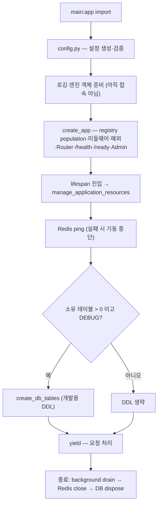
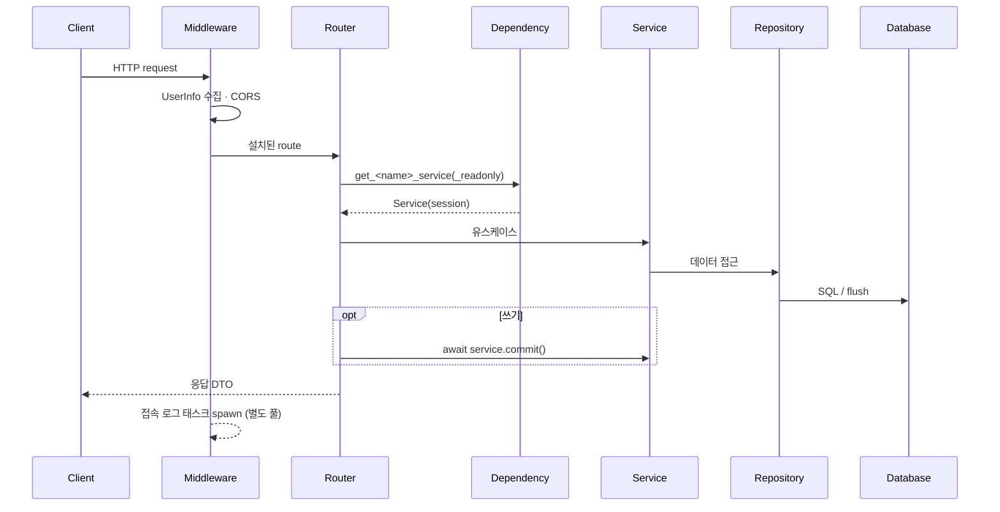
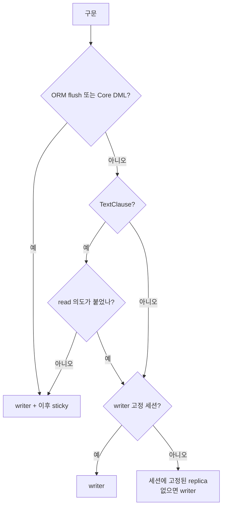

# 아키텍처 레퍼런스

이 문서는 **지금 코드가 어떻게 동작하는가**를 한곳에 모은 정본이다. 설치·실행은
[README](../../README.md), 새 기능을 만드는 방법과 규칙은 [개발 가이드](./DEVELOPMENT.md)가 맡는다.

- 기준: 2026-09-17 작업 트리. 코드와 이 문서가 어긋나면 **코드가 정답**이고, 확인한 뒤 이 문서를 고친다.
- 폴더 트리는 README 의 [프로젝트 구조](../../README.md#프로젝트-구조)에만 둔다. 여기서는 모듈의 책임을 설명한다.
- 설정 → 기동 → 요청 → 종료를 코드 흐름대로 따라 읽는 요약은 [서버 수명주기 안내서](./server-lifecycle-guide.html)다.
  표·수치(예산·기본값·순서)의 정본은 이 문서이고, 안내서는 이 문서와 어긋나지 않게 함께 고친다.
- 문서 전체 색인은 README 의 [문서 안내](../../README.md#문서-안내) 한 곳에 있다.
- 문서 정합성은 `tests/test_docs_consistency.py`·`tests/test_docs_references.py` 가 검사한다.

## 목차

0. [목적과 설계 원칙](#0-목적과-설계-원칙)
1. [모듈 경계와 계층](#1-모듈-경계와-계층)
2. [App Registry — Django 식 수동 앱 설치](#2-app-registry--django-식-수동-앱-설치)
3. [서버 수명주기와 설정](#3-서버-수명주기와-설정)
4. [요청·세션·트랜잭션](#4-요청세션트랜잭션)
5. [로깅](#5-로깅)
6. [접속 로그](#6-접속-로그)
7. [인증 (JWT)](#7-인증-jwt)
8. [관리 화면 (SQLAdmin)](#8-관리-화면-sqladmin)
9. [Celery](#9-celery)
10. [Alembic 마이그레이션](#10-alembic-마이그레이션)
11. [운영·보안과 알려진 제한](#11-운영보안과-알려진-제한)
12. [변경 이력](#12-변경-이력)

---

## 0. 목적과 설계 원칙

이 저장소는 **Django 식으로 앱을 수동 설치하고, URL 은 라우터 파일로 수동 관리하는
FastAPI 프로젝트 골격**이다. 한 문장으로 줄이면 다음과 같다.

> 앱의 설치 여부와 순서는 사람이 한 곳(`config.INSTALLED_APPS`)에서 명시하고,
> 설치된 앱 내부의 결선(Router·Models·Admin)은 컨벤션이 처리한다.

| 결정 | 주체 |
|---|---|
| 어떤 앱을, 어떤 순서로 설치할지 | 사람 — `config.INSTALLED_APPS` |
| 설치된 앱의 Router·Models·Admin 결선 | App Registry — `AppConfig` 컨벤션 |

### 0.1 원칙

- **설치는 목록에만 있다.** `app/features/` 에 디렉터리를 만드는 것으로는 아무 일도 일어나지 않는다.
  목록에서 빼면 디렉터리가 남아 있어도 route·registry 소유 모델·Admin·`ready()` 가 모두 빠진다.
  대가로 설치 범위를 한 곳에서 읽고, 로드 순서를 목록 순서로 통제하며, 실험 중인 앱을 비활성으로 둘 수 있다.
- **URL 은 라우터 파일 계층이 소유한다.** 프레임워크가 경로를 추론하지 않는다.

  ```text
  v1/<view>.py   엔드포인트 경로        /products
  router.py      버전·기능 prefix, tag  /v1/catalog, tags=["Catalog"]
  AppConfig      마운트 prefix          /api
    → /api/v1/catalog/products
  ```

- **기능 중심 구조.** 한 기능의 Router·Dependency·Service·Repository·Model·Schema·Admin·테스트는
  `app/features/<name>/` 안에 둔다. 기능 단위로 복사·삭제할 수 있어야 "탈착 가능한 앱"이 성립한다.
- **예측 가능한 트랜잭션 경계.** 커밋은 쓰기 핸들러 본문이 응답 전에 한 번 한다(§4.5).
  별도 UnitOfWork 계층은 두지 않는다.
- **조용한 실패 금지.** 선택 모듈 부재는 허용하지만, 모듈 안의 import 오류·공개 이름 누락·route 충돌은 기동 실패다.

### 0.2 의도적으로 택하지 않은 것

| 택하지 않은 것 | 이유 |
|---|---|
| 디렉터리 자동 스캔으로 앱 활성화 | 설치 범위와 순서가 파일 시스템 상태에 암묵적으로 끌려간다 |
| `main.py` 에 `include_router` 를 앱마다 나열 | 앱이 늘수록 `main.py` 가 모든 기능 추가의 공유 편집 지점이 된다(한때 이 방식으로 되돌렸다가 registry 로 복귀했다 — §12) |
| 기능 간 직접 import·FK·relationship 중심의 예제 | 앱 탈착성이 깨진다. 실제 제품에서 관계를 추가할 때는 앱 제거 가능성과 migration 순서를 함께 설계한다 |
| SQLAdmin 인증 백엔드 | 영구 비목표. 대신 운영 환경에서는 명시적 승인 없이 기동을 거부한다(§8) |
| 인메모리 레이트 리밋 | 워커별로 카운터가 갈라져 실질 한도를 보장하지 못했다. 필요하면 프록시·게이트웨이에서 건다 |

---

## 1. 모듈 경계와 계층

### 1.1 의존 방향

```text
features → core → utils
```

| 영역 | 역할 | 규칙 |
|---|---|---|
| `app/features/<name>/` | 기능 vertical slice | 비즈니스 코드는 전부 여기. 다른 기능을 import 하지 않는다 — 예외는 횡단 관심사인 `auth` 가 `user` 의 `User` 모델·Repository 를 쓰는 것 하나 |
| `app/core/` | 프레임워크 인프라 | 기능 구현을 직접 import 하지 않는다. 기능이 core 에 붙어야 하면 등록 훅을 쓴다(예: home 이 `set_access_log_sink()` 로 sink 등록). `Apps`·wiring adapter 만 설치 목록에 따라 기능 모듈을 동적으로 import 한다 |
| `app/utils/` | 순수 유틸(로그·인증·페이지네이션·검증) | 상위 계층에 의존하지 않는다 |

의존 방향은 `tests/test_layering_and_openapi.py` 가 AST 로 검사한다.

### 1.2 계층 책임

```text
Router(view) → Depends(get_<name>_service) → Service(session) → Repository → AsyncSession → DB
     ↑ 쓰기면 await service.commit() 을 여기서
```

| 계층 | 하는 일 | 하지 않는 일 |
|---|---|---|
| Router(view) | HTTP 입력 검증·Service 호출·**커밋 시점 결정**·응답 DTO 변환·OpenAPI 메타데이터 | SQL, 도메인 규칙 |
| Dependency | 세션 종류 선택, `Service(session)` 조립 후 **return** | 비즈니스 실행, 커밋 |
| Service | 유스케이스·도메인 규칙, Repository 조합, 부재 → 기능 예외 변환 | FastAPI Request/Response 의존, SQL 문자열, 커밋 시점 결정 |
| Repository | 데이터 접근(ORM 또는 Raw), 필요 시 flush | 커밋, HTTP 상태 결정 |
| Model / Schema | 테이블 매핑 / 외부 입출력 계약 | 앱 조립 |

### 1.3 core 모듈 책임

| 모듈 | 책임 |
|---|---|
| `app/core/bootstrap.py` | `create_app()` factory, `lifespan`, 전역 예외 핸들러 4종, `/health`·`/ready`·Scalar `/docs` |
| `app/core/resources.py` | `manage_application_resources()` — Redis 검증, 개발용 테이블 생성, 종료 순서 |
| `app/core/apps/` | `AppConfig`·`Apps`·예외(Django lifecycle) + `wiring.py`(FastAPI·SQLAdmin adapter) |
| `app/core/db/session.py` | 엔진·세션 팩토리, 세션 Dependency, `background_session()`, `owned_tables()`, `create_db_tables()`, `ping_writer_db()`, `dispose_engine()` |
| `app/core/db/router.py` | `DatabaseRouter`·`RoutingSession`, `using_writer`·`mark_read_only`·`is_read_only_session`, `read_intent`·`write_intent` |
| `app/core/db/errors.py` | `convert_db_error()` — DB 예외를 SQL·바인딩 값 없이 애플리케이션 예외로 변환 |
| `app/core/exception.py` | `AppException` 계층과 `ErrorResponse` |
| `app/core/models/models_base.py` | `Base` + `UUIDPrimaryKeyMixin`·`CreatedAtMixin`·`UpdatedAtMixin`·`TimestampMixin` |
| `app/core/repositories/` | ORM: `CRUDBase`·`BaseRepository` / Raw: `RawCRUDBase`·`RawRepositoryBase` (두 계열은 상속 관계가 없다) |
| `app/core/services/services_base.py` | `BaseService` — 세션 보관, `commit()`·`rollback()` 헬퍼 |
| `app/core/middlewares/` | CORS, `UserInfoMiddleware`, `AccessLogSink` Protocol, `BackgroundTaskRunner` |
| `app/core/tags_metadata.py` | OpenAPI 태그 선언(라우터 태그와 집합이 같아야 한다) |

---

## 2. App Registry — Django 식 수동 앱 설치

### 2.1 `config.INSTALLED_APPS`

```python
INSTALLED_APPS: list[str] = [
    "app.features.home.apps.HomeConfig",
    "app.features.blog.apps.BlogConfig",
    "app.features.reply.apps.ReplyConfig",
    "app.features.sns.apps.SnsConfig",
    "app.features.user.apps.UserConfig",
    "app.features.auth.apps.AuthConfig",
    "app.features.catalog.apps.CatalogConfig",   # ORM 예제
    "app.features.reports.apps.ReportsConfig",   # Raw SQL 예제
]
```

- 항목 형식은 Django 와 같다. **config class 경로**(권장)와 **package 경로**(`"app.features.blog"` →
  `blog.apps` 에서 기본 config 선택) 둘 다 받는다. 짧은 이름(`"blog"`)은 받지 않는다.
- **순서가 계약이다.** population·`ready()`·Router 등록·Admin view 등록이 모두 이 순서를 따른다. 새 앱은 뒤에 붙인다.
- 환경변수로 덮어쓰지 않는다. 설치 구성은 코드 리뷰 대상이다.
- 새 **프로세스**에서 목록에서 뺀 앱은 결선 대상에서 빠진다. 다만 같은 프로세스에서 이미 import 한 매핑 클래스는
  전역 `Base.metadata` 에 남는다. registry 를 새로 만들어도 SQLAlchemy metadata 가 청소되지는 않는다.

### 2.2 앱 패키지와 결선 컨벤션

```python
# app/features/<name>/apps.py
from app.core.apps import AppConfig


class <Name>Config(AppConfig):
    name = "app.features.<name>"
```

기능 root `__init__.py` 는 **가벼운 package marker** 다. Router 도 Model 도 import 하지 않는다 —
1단계(root package import)에서 하위 모듈이 딸려오면 3단계 순서가 무너진다.

| `AppConfig` 속성 | 기본값 | 의미 |
|---|---|---|
| `name` | (필수) | 앱 package 전체 경로 |
| `label` | `name` 의 마지막 조각 | 유일해야 하고 유효한 Python identifier 여야 한다 |
| `verbose_name` | label 의 title 표현 | 예: `SnsConfig` 는 `"SNS"` 로 재정의 |
| `default` | `None` | `<package>.apps` 에 config 가 여럿일 때 선택 표시 |
| `router_module` / `router_attribute` | `api.routers.router` / `<label>_router` | Router 결선 |
| `models_module` | `models` | 이 module 에 **노출된** 매핑 클래스 중 `__module__` 이 앱 하위인 것을 수집 — `models/__init__.py` 에서 재노출해야 한다 |
| `admin_module` | `admin` | 공개 이름 `admin_views` |
| `router_prefix` | `/api` | 마운트 prefix, 앱별 재정의 가능 |

| 구성요소 | module 이 없으면 | module 은 있는데 공개 이름이 없거나 내부 import 가 깨지면 |
|---|---|---|
| Router | route 없는 앱(정상) | 기동 실패 (`ImproperlyConfigured` / 원래 `ModuleNotFoundError`) |
| Models | 테이블 없는 앱(정상, 예: `auth`) | 기동 실패 |
| Admin | 관리 화면 없는 앱(정상) | 기동 실패 |

### 2.3 3단계 population

```text
Apps.populate(INSTALLED_APPS)
  1) config/root package import   →  apps_ready = True
  2) models import                →  models_ready = True
  3) AppConfig.ready()            →  ready = True
```

- 단계는 **앱별이 아니라 phase 단위**다. 모든 앱의 1단계가 끝난 뒤 2단계로 간다 — 어떤 `ready()` 든 모든 앱의 모델을 볼 수 있다.
- 중복 항목, 중복 `name`, 중복 `label`, 잘못된 label, 해석할 수 없는 항목, `AppConfig` 가 아닌 class,
  기본 config 를 고를 수 없는 경우(복수 후보에 `default=True` 가 하나가 아님)는 `ImproperlyConfigured`.
- `populate()` 는 thread-safe(RLock)하고 멱등이다. 완료 후 재호출은 no-op, 진행 중 재진입은 `RuntimeError`
  (`ready()` 안에서 `populate()` 를 부르지 않는다). 실패하면 registry 상태를 되돌린 뒤 원래 예외를 전파한다 —
  단, 이미 import 된 Python 모듈과 전역 metadata 까지 되돌리지는 않는다.
- `populate(..., run_ready=False)` 는 1·2단계만 수행한다. Alembic 과 startup DDL 준비가 쓴다. 이후 같은 registry 에
  `run_ready=True` 로 다시 부르면 3단계만 실행된다.
- 조회 API: `get_app_configs()`, `get_app_config(label)`, `is_installed(name)`, `get_models()`,
  `get_model(app_label, model_name)`(대소문자 무시). 준비 전 조회는 `AppRegistryNotReady`, 없는 대상은 `AppLookupError`.
- 전역 기본 registry 는 `app.core.apps.apps`. 테스트와 factory 는 `Apps()` 를 새로 만들어 주입할 수 있다.

### 2.4 wiring adapter (`app/core/apps/wiring.py`)

| 함수 | 동작 |
|---|---|
| `install_routers(app, registry)` | 설치 순서대로 `<label>_router` 를 `router_prefix` 로 마운트. 두 앱이 같은 method + 최종 path 를 등록하면 `ImproperlyConfigured` 로 기동 실패(먼저 등록된 쪽이 조용히 이기지 않는다) |
| `install_admin(admin, registry)` | 설치 앱의 `admin_views` 를 선언 순서대로 `add_view` |
| `create_admin(app, engine, registry, title=...)` | **함수 안에서** `sqladmin` 을 import 하고 `/admin` 을 마운트. `ADMIN=false` 프로세스는 sqladmin 과 앱별 `admin.py` 를 로드조차 하지 않는다 |

`app/core/apps/config.py`·`registry.py` 는 FastAPI·SQLAdmin·SQLAlchemy 를 import 하지 않는다. Alembic·CLI 가
registry 를 써도 웹 스택이 딸려오지 않는다(`tests/core/apps/test_core_independence.py`,
`tests/core/test_admin_lazy_loading.py`).

### 2.5 `ready()` 의 제약

`ready()` 는 **process-local wiring 전용**이다.

- 허용: 모듈 전역 결선(예: `HomeConfig.ready()` 의 access-log sink 등록 — 현재 유일한 사용처), 다른 앱 모델 조회(`apps.get_model(...)`)
- 금지: DB 쿼리·커밋, network 호출, subprocess 실행, secret 출력

migration 과 CLI 도 이 hook 을 실행할 수 있기 때문이다(`alembic upgrade` 가 외부 연결을 만들면 배포가 예측 불가능해진다).
Alembic 은 `run_ready=False` 로 hook 자체를 건너뛴다. 회귀 가드는
`tests/core/apps/test_installed_apps.py` 의 `test_ready_hooks_perform_no_io`(구현을 AST 로 읽는다).

### 2.6 Django 호환 범위

기준: [Django 6.0 — Applications](https://docs.djangoproject.com/en/6.0/ref/applications/). "Django 식"이
어디까지 실제 호환이고 어디부터 이 프로젝트 확장인지 구분한다.

**동일** — app loading lifecycle 의 공개 의미를 보존한다.

| 항목 | Django | 이 프로젝트 |
|---|---|---|
| 설치 목록 | `settings.INSTALLED_APPS` | `config.INSTALLED_APPS` |
| 항목 형식 | package 경로 또는 `AppConfig` class 경로 | 동일 |
| 기본 config 선택 | `<package>.apps` 후보 0개 → 기본 `AppConfig`, 1개 → 그것, 복수 → 유일한 `default=True` | 동일 |
| 정규화 결과 | `name`·`label`·`verbose_name`·`path`·`module` | 동일 |
| 초기화 | config/root package → models → `ready()`, phase 단위, 목록 순서 | 동일 |
| 준비 상태 | `apps_ready`·`models_ready`·`ready` | 동일 |
| 고유성 | `name`·`label` 각각 유일 | 동일 |
| 조회 API | `get_app_configs`·`get_app_config`·`is_installed`·`get_models`·`get_model` | 동일(`get_model` 대소문자 무시) |
| 재진입 / 중복 populate | 금지 / no-op | `RuntimeError` / no-op |

| Django 예외 | 이 프로젝트 (`app.core.apps.exceptions`) |
|---|---|
| `django.core.exceptions.ImproperlyConfigured` | `ImproperlyConfigured` |
| `django.core.exceptions.AppRegistryNotReady` | `AppRegistryNotReady` |
| `LookupError` | `AppLookupError` (`LookupError` 서브클래스) |

모든 registry 예외의 공통 base 는 `AppRegistryError` 다.

**확장** — Django 에는 없다. Django 기능이라고 부르지 않는다.

| 항목 | 동작 |
|---|---|
| Router 결선 | `router_module` 의 `<label>_router` 를 `router_prefix` 로 마운트, route 충돌 시 기동 실패 |
| Admin 결선 | `admin_module` 의 `admin_views` 를 SQLAdmin 에 등록(지연 import) |
| Model 수집 | SQLAlchemy 매핑 클래스 중 `__module__` 이 앱 package 하위인 것 |
| Alembic 통합 | `migrations/env.py` 가 같은 구현을 `run_ready=False` 로 사용 |
| `create_app()` | 설치 목록·registry·Admin 여부를 주입받는 factory |
| 선택 module 구분 | 부재는 허용, 내부 import 실패는 기동 실패 |

**비지원** — Django 코드를 옮겨도 동작하지 않는다.

| Django 기능 | 대체 |
|---|---|
| Django ORM·QuerySet·manager | SQLAlchemy 2.0 async |
| Django migration engine | Alembic |
| URLConf (`urls.py`, `path()`, `reverse()`) | FastAPI `APIRouter` |
| signals | 명시적 Service 호출 |
| template / static 자동 탐색 | 없음(API 전용) |
| management command 프레임워크 | `scripts/` 의 개별 스크립트 |
| `AppConfig.default_auto_field` | 모델이 직접 선언(`UUIDPrimaryKeyMixin`) |
| `apps.get_containing_app_config()` | 없음 |
| settings 분기에 따른 조건부 설치 | 없음 — 목록은 코드 리뷰 대상 |
| 앱 제거 시 데이터 migration 자동 생성 | 없음(§2.7) |

### 2.7 앱 비활성화·제거 시 주의

**목록에서 빼도 테이블은 지워지지 않는다.** 앱을 목록에서 빼면 route·Admin view·`ready()` 는 즉시 사라지고,
깨끗한 migration 프로세스에서 그 앱의 모델이 수집 대상에서 빠진다 → `alembic revision --autogenerate` 가
DROP TABLE 을 **제안할 수 있다**. 데이터를 보존해야 하면 생성된 migration 을 그대로 적용하지 않는다.

```text
1. 앱을 목록에서 뺀다 → 테스트 → route/Admin 이 사라졌는지 확인
2. alembic revision --autogenerate 로 제안된 diff 를 읽는다
3. 데이터가 필요 없으면 그대로, 필요하면 편집하거나 별도 보존 절차를 만든다
4. alembic upgrade head
```

### 2.8 코드 주석의 요구 ID 색인

코드·테스트 주석의 `FR-*`·`CR-*`·`NFR-*`·`SEC-*`·`AC-*` 와 `§6.x` 는 registry 이식(2026-08-12) 때의 통합 계획서
번호다. 계획서는 구축 완료 후 커밋 `602afb7` 에서 삭제했고(원문은 그 부모 커밋에 있다), 의미는 아래가 유지한다. `RAW-REP-*`·`NFR-0xx`·`DOC-*`·`development-plan §N`·`Phase N` 은
`docs/specs/orm-raw-repository/` 를, `ADR-*`·`C-*`·`F-*`·`L-*` 는 `docs/crp/groups/` 를 가리킨다.

| ID | 의미 |
|---|---|
| FR-01 | 설치 SSOT 는 `config.INSTALLED_APPS`. 디렉터리 존재만으로 활성화하지 않는다 |
| FR-02 / FR-03 | package 경로·config class 경로를 받아 `AppConfig`(name·label·verbose_name·path·module)로 정규화 |
| FR-04 | 설치 앱의 Router·Models·Admin 을 설정대로 결선, 구성요소 없는 앱 허용 |
| FR-05 | 조회 API 5종 제공 |
| FR-06 | 모델 import 와 Alembic metadata 가 같은 목록·같은 registry 구현을 쓴다 |
| FR-07 | `create_app()` 이 population → middleware → 예외 → Router → 조건부 Admin 순으로 조립 (§6.5) |
| FR-08 | `AppConfig.ready()` hook |
| FR-09 / FR-10 | 생성기가 `apps.py`·Router 골격을 만들고, 설정 파일은 고치지 않은 채 붙여 넣을 한 줄을 출력 |
| CR-01 / CR-02 | 기본 config 선택 규칙 / explicit class 검증 |
| CR-03 / CR-05 / CR-07 | 3단계 순서, 준비 flag 는 phase 완료 후, `ready()` 는 앱별 1회 |
| CR-04 / CR-06 | name·label 유일성과 identifier 검증 / 준비 전·조회 실패를 명시적 예외로 |
| CR-08 | Router·SQLAdmin 결선은 adapter 이며 Django 기능이라 부르지 않는다 |
| NFR-01 | 등록 순서가 결정적(파일 시스템 열거 순서에 의존하지 않음) |
| NFR-02 / NFR-04 | populate 는 thread-safe·멱등·재진입 거부 / 실패 시 부분 상태를 남기지 않음 |
| NFR-03 / NFR-07 | 모듈 부재와 내부 import 실패 구분(traceback 보존) / 오류 메시지에 고칠 위치 포함 |
| NFR-05 / NFR-06 | 격리 `Apps()` 주입 가능 / registry core 는 FastAPI·SQLAdmin 에 의존하지 않음 |
| NFR-08 | registry·adapter 커버리지 기준(프로젝트 전체 85% 는 CI 가 강제) |
| SEC-01 | `ADMIN=false` 면 sqladmin·앱 `admin.py` 를 로드하지 않음 |
| SEC-02 | allowlist(`INSTALLED_APPS`)만 import, 디렉터리 스캔 금지 |
| SEC-03 / SEC-04 | 생성기 경로 이탈 차단 / 부분 생성·덮어쓰기 금지 |
| SEC-05 | `ready()` 에서 DB·network·subprocess·secret 출력 금지 |
| SEC-07 | 내부 import 실패를 선택 기능 부재로 위장하지 않음 |
| §6.7 | Alembic 은 `run_ready=False` 로 registry 를 채운다 |

| 인수 조건 | 검증 테스트 |
|---|---|
| AC-01 config 선택·정규화 | `tests/core/apps/test_config.py` |
| AC-02 population 순서 | `tests/core/apps/test_population_order.py` |
| AC-03 오류 종류·메시지 | `tests/core/apps/test_registry_errors.py` |
| AC-04 동시·재진입·멱등 | `tests/core/apps/test_registry_lifecycle.py` |
| AC-05 선택 module | `tests/core/apps/test_optional_modules.py` |
| AC-06 미등록 앱 비노출 | `tests/core/apps/test_manual_registration.py` |
| AC-07 Admin 지연 로드 | `tests/core/test_admin_lazy_loading.py` |
| AC-08 Admin 결선 | `tests/core/test_admin_wiring.py` |
| AC-09 runtime·Alembic 모델 동일 | `tests/core/test_alembic_metadata.py`, `tests/core/test_migration_chain.py` |
| AC-10 / AC-11 생성기 동작·경계 | `tests/scripts/test_new_app.py` |

---

## 3. 서버 수명주기와 설정



### 3.1 진입점과 프로세스 경계

- `main.py` 는 `app = create_app()` 과 직접 실행용 `uvicorn.run()` 만 둔다. 직접 실행(`uv run python main.py`)은
  `SERVER_HOST`·`SERVER_PORT`·`reload=DEBUG`·`setup_uvicorn_logging()` 을 넘긴다. `uvicorn main:app` CLI 는
  CLI 옵션을 따르며 `DEBUG=true` 만으로 reload 가 켜지지 않는다.
- 두 경로 모두 정상 ASGI lifespan 을 탄다. `--lifespan off` 는 Redis 검증·자원 정리를 건너뛰므로 정상 경로가 아니다.
- reload·다중 worker 는 프로세스마다 import·lifespan 을 다시 수행한다. API worker 마다 Redis client 와 DB pool 이 따로 있고,
  Celery worker 는 별도 프로세스다.
- factory 로 만든 이유는 테스트가 **격리된 앱**(auth 를 뺀 앱, `ADMIN=False` 앱, 독립 registry 앱)을 만들어
  "등록 안 한 앱은 안 붙는다"를 실행으로 증명하기 위해서다.

### 3.2 설정 로딩

`config.py` 의 각 `BaseSettings` 는 `env_file=".env"`, `extra="ignore"` 로 **자기 필드만** 해석한다.

- 우선순위: 프로세스 환경변수 → **작업 디렉터리의** `.env` → 필드 기본값. `.env.example` 은 복사용 목록이며 자동 fallback 이 아니다.
- 리스트 값은 JSON 배열로 준다(예: `CORS_ALLOW_ORIGINS=["http://localhost:3000"]`). `DEBUG=false` 는 bool 로 파싱된다.
- `get_*_settings()` 는 `lru_cache` 싱글턴이고, 모듈 끝의 `app_settings` 등 전역 참조가 import 시 만들어진다.
  실행 중 `.env` 를 바꿔도 반영되지 않는다. 테스트에서 캐시를 비워도 이미 가져간 전역 참조는 바뀌지 않는다.
- 타입 오류·validator 위반은 `config` import 자체를 실패시킨다(lifespan 이전).

| 설정 클래스 (전역 인스턴스) | 소비처 |
|---|---|
| `TimezoneSettings` (`timezone_settings`) | 모델 시각 기본값, 로그 시각, Celery timezone |
| `AppSettings` (`app_settings`) | 앱 메타데이터, `DEBUG`·`ENV`·`ADMIN`, 직접 실행 host/port |
| `DatabaseSettings` (`db_settings`) | DSN·라우팅·풀, `session.py`, Alembic URL |
| `CORSSettings` (`cors_settings`) | `CustomCORSMiddleware` |
| `LogSettings` (`log_settings`) | `build_dictconfig()` |
| `MiddlewareSettings` (`middleware_settings`) | `UserInfoMiddleware` 활성·제외 규칙 |
| `RedisSettings` (`redis_settings`) | startup Redis ping, Celery broker/backend |
| `JWTSettings` (`jwt_settings`) | 토큰 서명·검증·수명 |
| `ApiSettings`·`SessionSettings`·`SMTPSettings`·`UploadSettings` | **선언만 있고 소비처가 없다.** 값을 바꿔도 동작이 변하지 않는다(버전 prefix 는 라우터 파일의 `/v1` 이 정한다) |

`LogSettings` 의 `LOG_CONSOLE_ENABLED`·`LOG_CONSOLE_FORMAT`·`LOG_FILE_FORMAT`·`LOG_DATE_FORMAT` 도 현재 로깅 구성에서 읽지 않는다(§5).

**설정 검증(fail-fast)**

| 검증 | 거부 조건 |
|---|---|
| `AppSettings._guard_unauthenticated_admin` | `ENV` 가 production/staging 이고 `ADMIN=true` 인데 `ADMIN_UNAUTHENTICATED_ACK` 가 false |
| `DatabaseSettings._validate_routing` | 복제 on + 라우터 off, 복제 on + replica 목록 비어 있음, 잘못된 replica 표기(IPv6 는 대괄호 필수), `DB_MAX_SERVER_CONNECTIONS` 가 0이 아닐 때 최대 연결 수 초과 |
| `CORSSettings._reject_wildcard_with_credentials` | Origin `*` 와 `CORS_ALLOW_CREDENTIALS=true` 조합 |
| `SMTPSettings._reject_tls_with_ssl` | TLS·SSL 동시 활성 |
| `_validate_cross_settings()` | production/staging 에서 `LOG_SQL_ECHO_ENABLED=true` |
| `validate_deployment_safety()` | production/staging 에서 `ACCESS_TOKEN_SECRET_KEY`·`REFRESH_TOKEN_SECRET_KEY`·`SESSION_SECRET_KEY` 중 placeholder(빈 값·`your-` 시작·`change-this` 포함)가 있거나 access 키 = refresh 키. 위반을 한 번에 모아 `ValueError` 로 알리고 메시지에는 설정 **이름만** 담는다(값은 싣지 않는다). development/test 는 검사하지 않는다 |

`_validate_cross_settings()`·`validate_deployment_safety()` 는 모듈 함수라 `config` import 시점에 차례로 실행된다 — 호출을 빠뜨릴 수 없다.

**주요 환경변수** (전체 목록과 설명은 `.env.example`)

| 변수 | 기본값 | 효과 |
|---|---|---|
| `DEBUG` | `true` | true: 개발용 테이블 자동 생성, `/docs`·`/openapi.json` 노출, 미지정 로그 레벨 DEBUG, 직접 실행 시 reload. false: 모두 반대(로그 INFO, 스키마는 Alembic) |
| `ADMIN` | `true` | `/admin` 마운트. `DEBUG` 와 독립. 인증 없음(§8) |
| `ADMIN_UNAUTHENTICATED_ACK` | `false` | production/staging 에서 `ADMIN=true` 를 허용하는 명시적 승인 |
| `ENV` | `development` | development / staging / production / test. 로그 핸들러·타임존과 위 검증에 쓰인다 |
| `SERVER_HOST` / `SERVER_PORT` | `0.0.0.0` / `8000` | 직접 실행 시 바인딩 |
| `MYSQL_HOST` / `MYSQL_PORT` / `MYSQL_USER` / `MYSQL_PASSWORD` / `MYSQL_DATABASE` | `localhost` / `3306` / `root` / 빈 값 / `fastapi_db` | primary(writer) DSN |
| `DB_ROUTER_ENABLED` / `DB_REPLICATION_ENABLED` | `false` / `false` | 읽기/쓰기 라우팅(§4.4) |
| `REDIS_HOST` / `REDIS_PORT` / `REDIS_DB` / `REDIS_PASSWORD` | `localhost` / `6379` / `0` / 없음 | startup ping 대상이자 Celery broker/backend |
| `ACCESS_TOKEN_SECRET_KEY` / `REFRESH_TOKEN_SECRET_KEY` | `change-this-...` | JWT 서명 키(§7). staging/production 은 placeholder·동일 키 거부 |
| `SESSION_SECRET_KEY` | `change-this-...` | 세션 키(소비처 없음). staging/production 은 placeholder 거부 |

### 3.3 `create_app()` 조립 순서

```python
def create_app(installed_apps=None, registry=None, *, enable_admin=None) -> FastAPI: ...
```

1. 설치 목록 결정(`config.INSTALLED_APPS` 또는 주입값), registry 결정(전역 `apps` 또는 주입값)
2. `registry.populate(apps_list)` — config → models → `ready()`
3. `FastAPI(...)` 생성 — `docs_url=None`, `redoc_url=None`, `openapi_url` 은 `DEBUG` 일 때만 `/openapi.json`, `lifespan` 연결
4. CORS → `UserInfoMiddleware` 등록(나중에 추가한 UserInfo 가 바깥쪽에서 감싼다), 전역 예외 핸들러 4종
5. `install_routers(app, registry)`
6. `/health`, `/ready`, `DEBUG` 일 때만 Scalar `/docs`
7. `app.state.app_registry` 저장, `enable_admin`(기본 `ADMIN`)이면 `create_admin(...)`

2번이 3번보다 먼저인 이유는 모델·hook 등록을 앱 조립 전에 끝내기 위해서다.

### 3.4 lifespan 과 자원 관리

`lifespan` 은 `manage_application_resources(app)` 를 열고 yield 할 뿐이다. 자원별 코드는 `app/core/resources.py` 한 곳에 있다.

```python
async with AsyncExitStack() as cleanup:
    cleanup.push_async_callback(_dispose_db_engines)       # 종료 시 3번째
    await cleanup.enter_async_context(_redis(app))         # 종료 시 2번째
    cleanup.push_async_callback(_drain_background_tasks)   # 종료 시 1번째
    await _prepare_database(resources)
    yield resources
```

**Redis 검증** — `Redis.from_url(redis_settings.REDIS_URL, socket_connect_timeout=5, socket_timeout=5)` 후 `ping()`.
실패하면 오류 타입만 ERROR 로 남기고 다시 raise 한다 → yield 에 도달하지 않아 서버가 시작되지 않는다.
`DEBUG` 와 무관한 필수 조건이며 끄는 설정은 없다. 성공한 client 는 `app.state.redis` 에 보관되지만, 이를 주입하는
공통 Dependency 나 캐시 구현은 없다. ping 성공은 기동 순간의 도달 가능성일 뿐이고 `/ready` 는 Redis 를 다시 보지 않는다.

**개발용 테이블 생성** — `_prepare_database()` 는 전역 `apps` 를 `populate(INSTALLED_APPS, run_ready=False)`
(기본 경로에서는 이미 완료돼 no-op)한 뒤 `owned_tables()` 로 **registry 가 소유한 테이블만** 센다.

| 조건 | 동작 |
|---|---|
| 소유 테이블 0개 | DB 에 접속하지 않는다 |
| `DEBUG=false` | 생성하지 않는다(Alembic 사용) |
| `DEBUG=true` | `create_db_tables(populate=False)` — writer `engine.begin()` 안에서 `Base.metadata.create_all(tables=소유 테이블)`, 30초 timeout |

`create_all` 은 없는 테이블만 만든다. 컬럼 변경·삭제·데이터 이동은 하지 않으며 DB 자체와 계정 권한은 미리 있어야 한다.
여러 worker 가 `DEBUG=true` 로 동시에 DDL 을 시도할 수 있으므로 운영은 `DEBUG=false` + 별도 migration 주체가 원칙이다.

> **custom factory 주의** — `create_app(installed_apps, registry)` 로 조립해도 현재 `_prepare_database()`·`owned_tables()`
> 는 주입된 registry 가 아니라 전역 `apps`·`config.INSTALLED_APPS` 를 본다. 격리 factory 의 route 집합과 startup DDL 집합이
> 자동으로 일치한다고 가정하지 않는다.

**종료** — background task drain → Redis `aclose()` → DB engine dispose.

| 단계 | 예산 | 비고 |
|---|---|---|
| background drain | 5초 | 그중 4초는 완료 대기, 남은 시간에 미완료 태스크를 cancel 후 gather 로 회수 |
| Redis close | 5초 | client pool 정리일 뿐 서버·키에 영향 없음 |
| DB dispose | 10초 | writer → replica → background 순차. 앞 엔진 오류가 뒤 엔진 dispose 를 건너뛰게 할 수 있다 |

각 단계는 `_run_cleanup()` 이 감싸 실패·timeout 을 로그로 남기고 다음 단계로 넘어간다(전체 deadline 은 없다).
startup ping 실패도 client 종료와 이미 등록된 DB 정리 경로를 탄다(background drain 은 아직 등록 전). 끝나면
`app.state.resources` 를 `None` 으로 되돌린다. SIGKILL·강제 종료에서는 회수를 보장하지 않는다.
logging 은 console/file 핸들러를 직접 붙이는 구조라 닫을 queue listener 가 없다.

### 3.5 health · ready · 오류 응답

| 경로 / 오류 | 의미 |
|---|---|
| `GET /health` | liveness. `{"status": "healthy", "version": VERSION}`. DB·Redis 를 보지 않는다 — liveness 가 DB 에 의존하면 DB 가 흔들릴 때 오케스트레이터가 멀쩡한 프로세스를 죽인다 |
| `GET /ready` | readiness. `ping_writer_db()` 가 writer 에 `SELECT 1` 을 2초 안에 실행. 실패·timeout 은 원인을 숨긴 503(원인 타입만 서버 로그). 준비 안 된 인스턴스는 재시작이 아니라 LB 에서 뺀다 |
| `/docs`, `/openapi.json` | `DEBUG=true` 일 때만. Swagger UI·ReDoc 은 끔 |
| 설정·registry 오류 | lifespan 이전 조립 실패 |
| Redis ping·개발 DDL 오류 | startup 실패 |
| 요청 중 오류 | 전역 예외 핸들러 |
| background 저장 오류 | 이미 나간 응답과 무관(로그만) |

전역 핸들러 4종은 모두 `ErrorResponse{error_code, message, detail}` 로 응답한다.

| 예외 | 처리 |
|---|---|
| `AppException` 계열 | 예외의 status·error code 유지 (`NotFoundException` 404, `DuplicateException` 409, `DatabaseException` 500 등 — `app/core/exception.py`) |
| `RequestValidationError` | 422 VALIDATION_ERROR, detail 에 field·message·type 목록 |
| Starlette `HTTPException` | `HTTP_<status>` error code |
| 그 밖의 예외 | 500 INTERNAL_SERVER_ERROR, **DEBUG 에서도 detail 은 비운다**. SQLAlchemy 예외는 traceback 없이 타입·드라이버 코드만 로그 |

---

## 4. 요청·세션·트랜잭션

### 4.1 요청 흐름



1. `UserInfoMiddleware` 가 활성·제외 규칙을 보고 요청 정보를 수집한다. CORS 가 preflight·헤더를 처리한다.
2. registry 가 설치한 route 가 선택되고 FastAPI 가 path/query/body/form/header 와 Dependency 를 검증·해석한다.
3. Dependency 그래프: 세션 generator → `get_<name>_service` → `Service(session)` → Repository.
4. 쓰기 핸들러는 업무 후 `await service.commit()` 을 부르고 응답을 만든다. 조회는 커밋하지 않는다.
5. 예외로 빠져나가면 세션 generator 가 `rollback()` 후 재전파하고, 전역 핸들러가 오류 응답을 만든다.
6. 미들웨어가 응답 상태·소요 시간을 붙여 접속 로그 저장 태스크를 제출한다(§6).

FastAPI 는 한 요청 안에서 같은 Dependency 를 기본 캐시(`use_cache=True`)한다. writer getter 와 read-only getter 는
서로 다른 callable 이라 같은 세션이 아니다. Service 를 전역 싱글턴으로 두면 세션이 요청을 넘나들므로 금지한다.

### 4.2 세션 API

| API | 용도 | 특성 |
|---|---|---|
| `get_read_only_db_session()` | 조회 endpoint (기능 앱 표준) | 세션을 read-only 로 표시. 라우터 활성 시 replica 고정·ORM 쓰기 차단. 예외 시 rollback |
| `get_writer_db_session()` | 쓰기 endpoint (기능 앱 표준) | 첫 구문부터 writer 고정. 예외 시 rollback |
| `get_routed_db_session()` | 의도를 미리 정할 수 없는 예외 경로 | 구문 성격으로 자동 라우팅. 기능 앱은 쓰지 않는다 |
| `background_session()` | 요청 밖(sink·Celery) async context | background 풀, 예외 시 rollback, **커밋은 호출자** |
| `get_background_session()` | 요청 밖 generator 방식 | background 풀, 예외 시 rollback |

세션 팩토리는 `expire_on_commit=False`, `autoflush=False` 다. `session.add` 는 메모리 등록이라 동기, `flush`·`refresh`·`execute`·`commit` 은 await 한다.

### 4.3 엔진과 연결 예산

| 엔진 | 풀 (기본값) | 용도 |
|---|---|---|
| `engine` (= `writer_engine`) | `DB_POOL_SIZE` 20 + `DB_MAX_OVERFLOW` 20, timeout 30초 | 요청 처리·DDL·readiness·SQLAdmin |
| `read_engines` | replica 마다 writer 와 같은 크기 | 복제 활성 시 SELECT |
| `background_engine` | `DB_BACKGROUND_POOL_SIZE` 10 + `DB_BACKGROUND_MAX_OVERFLOW` 10, timeout 60초 | 접속 로그·요청 밖 작업, 라우팅 없이 primary |

모든 엔진은 `pool_pre_ping`, `pool_recycle=DB_POOL_RECYCLE`(280초 — DB/프록시 `wait_timeout` 보다 짧게),
반환 시 rollback, `connect_timeout` 10초, utf8mb4 를 쓴다. 엔진 생성은 import 시점이지만 **실제 연결은 첫 사용 때**다.

최대 연결 수(`db_settings.max_total_connections`)는 프로세스마다 다음과 같고 `DB_WORKER_PROCESSES`(uvicorn + celery worker 수)를 곱한다.

```text
(DB_POOL_SIZE + DB_MAX_OVERFLOW) × (1 + 복제 활성 시 replica 수) + (DB_BACKGROUND_POOL_SIZE + DB_BACKGROUND_MAX_OVERFLOW)
```

`DB_MAX_SERVER_CONNECTIONS` 를 주면 이 값이 넘칠 때 기동이 실패한다(0 이면 검증하지 않음).

### 4.4 읽기/쓰기 라우팅

`DB_ROUTER_ENABLED=false`(기본)면 세션이 writer 엔진에 직접 바인딩되고 라우터는 쓰이지 않는다.
켜면 `RoutingSession.get_bind()` 가 구문마다 엔진을 고른다.



- 쓰기 판정 시 세션이 read-only 로 표시돼 있으면 `ReadOnlyRoutingError`.
- `DB_READ_STICKY_AFTER_WRITE=true`(기본)면 쓰기 이후 같은 세션의 SELECT 는 writer 로 간다(read-after-write).
  새 요청의 read-only 세션까지 복제 지연을 없애 주지는 않는다.
- 한 세션은 라운드로빈으로 고른 replica 하나에 고정된다(트랜잭션이 여러 서버로 흩어지지 않도록).
- `DB_REPLICATION_ENABLED=true` 는 `DB_ROUTER_ENABLED=true` 와 `MYSQL_REPLICA_HOSTS` 를 요구한다. replica 계정·DB 를
  비우면 primary 값을 재사용한다. replica 없이 라우터만 켜면 읽기도 writer 로 간다.
- 복제 지연을 허용할 수 없는 읽기는 `using_writer(session)` 으로 writer 에 고정한다.
- 기동 시 `db_settings.describe_routing()` 이 비밀번호를 가린 DSN(`mask_dsn()`)으로 구성을 한 줄 남긴다.

**`text()` 는 SQL 을 해석하지 않는다.** 첫 단어 파싱은 `WITH doomed AS (SELECT ...) DELETE ...` 같은 CTE DML 을 읽기로
오판해 replica 로 보낸다. 그래서 호출부가 의도를 붙이고(`read_intent`·`write_intent`, 조회는 `statement_intent`),
**의도가 없는 `TextClause` 는 쓰기로 본다**(fail-closed). `RawRepositoryBase` 를 쓰면 메서드가 의도를 자동으로 붙인다.

**read-only 차단의 범위**

| 경로 | 차단 |
|---|---|
| ORM·Core 쓰기 | `RoutingSession` 에만 있다 → **라우터가 켜져 있을 때만** 동작. 기본 설정에서는 read-only 세션의 ORM 쓰기가 막히지 않는다 |
| Raw 쓰기(`execute`, `for_update=True`) | `RawCRUDBase` 가 `is_read_only_session()` 으로 **실행 전에** 거부 — 라우터 설정과 무관 |
| 임의 `session.execute()` | 완전한 sandbox 가 아니다. 조회 경로가 쓰지 않는다는 규칙은 `tests/test_read_path_no_commit.py` 가 구조로 고정 |

read-only 표시는 DB 권한을 대체하지 않는다. 운영에서는 replica 전용 읽기 계정을 함께 쓴다.

### 4.5 트랜잭션 경계

- **커밋은 쓰기 핸들러 본문이 응답 생성 전에 한 번.** Repository·Service·Dependency 는 스스로 커밋하지 않는다.
- 순서는 `response = XResponse.model_validate(obj)` → `await service.commit()` → `return response` 하나다. 응답 DTO 검증이
  실패하면 커밋 없이 500 으로 끝나고 세션 Dependency 가 rollback 한다(`tests/test_validate_before_commit.py`).
- 예외로 빠져나가면 세션 Dependency 가 rollback 한다. 이미 커밋한 뒤의 실패는 되돌리지 않는다.
- 여러 Service 를 한 원자 단위로 묶으려면 같은 writer 세션을 주입하고 마지막에 한 번 커밋한다.
- `BaseService.commit()` 은 커밋 시점의 `SQLAlchemyError`(지연 제약, 연결 유실 등)도 `convert_db_error()` 로 바꾼다.
- 요청 밖에서는 `background_session()` 을 열고 직접 커밋한다 — 성공 시 자동 커밋하지 않는다.

> **왜 Dependency 가 아니라 핸들러인가.** 예전에는 Dependency 가 `yield` 뒤에서 커밋했다. 기본 request scope 의
> yield dependency 종료 코드는 **응답 전송 후** 실행되므로(FastAPI 0.141 에서 실측), 커밋이 실패해도 클라이언트는
> 이미 201 을 받는다. function scope 는 종료 시점이 다르지만
> ([FastAPI 문서](https://fastapi.tiangolo.com/tutorial/dependencies/dependencies-with-yield/#early-exit-and-scope)),
> 이 프로젝트는 커밋을 teardown 에 맡기지 않는다. 회귀 가드: `tests/test_read_path_no_commit.py`,
> 기능별 `test_transaction_boundary.py`.

DB 커밋과 HTTP 전송은 하나의 원자적 트랜잭션이 아니다. 커밋 후 연결이 끊길 수 있으므로 중요한 생성 업무는 멱등 키 정책을 요구사항으로 정한다.

### 4.6 Repository 두 계열

데이터 접근은 **ORM 과 Raw SQL 두 계열**이고 갈라지는 곳은 Repository 하나뿐이다. 두 Base 는 **상속 관계가 없다**
(하나의 Base 가 모델과 row 를 함께 돌려주면 호출부가 받은 것을 타입으로 알 수 없다). 어느 쪽을 고를지와 Raw 작성
규칙은 [개발 가이드 — ORM 과 Raw 선택](./DEVELOPMENT.md#orm-raw)에 있다.

| | ORM | Raw SQL |
|---|---|---|
| 기능 Repository 가 상속 | `BaseRepository` (`app/core/repositories/repository_base.py`) | `RawRepositoryBase` (`app/core/repositories/raw_repository_base.py`) |
| 하위 primitive (직접 상속하지 않음) | `CRUDBase` (`app/core/repositories/crud_base.py`) | `RawCRUDBase` (`app/core/repositories/raw_crud_base.py`) |
| 돌려주는 것 | 모델 인스턴스 | `RowMapping` / scalar / rowcount |
| 참조 예제 | `app/features/catalog/repositories/product_repository.py` | `app/features/reports/repositories/sales_report_repository.py` |

**`BaseRepository[Model]` 공개 메서드 — 정확히 8개** (ADR-016). 도메인 쿼리(eager loading·집계·정렬 목록 등)는 기능 Repository 에 둔다.

| 메서드 | 동작 |
|---|---|
| `create(data: dict)` | `id` 가 없으면 UUID 를 채우고 add → flush → refresh. DB 오류는 `convert_db_error` |
| `get_by_id(id)` | 없으면 `None` |
| `get_one(**filters)` | `filter_by` 단건, 없으면 `None` |
| `get_all(skip=0, limit=100)` | offset/limit 조회 — **정렬을 지정하지 않는다** |
| `count(**filters)` | 개수 |
| `exists(id)` | PK 존재 여부 |
| `update(id, data: dict)` | UPDATE → flush 후 **다시 조회**해 반환(없으면 `None`). MySQL 의 no-op UPDATE rowcount 0 을 부재로 읽지 않기 위해서다 |
| `delete(id)` | 삭제 여부 `bool` |

**`RawRepositoryBase` 공개 메서드 — 4개**. 모든 호출에 `query_name`(코드 상수)이 필요하고, 로그에는 `query_name`·소요 시간·성공 여부만 남는다(SQL·파라미터 제외).

| 메서드 | 결과 없음 | 반환 | 라우팅 의도 |
|---|---|---|---|
| `fetch_one(stmt, params, *, query_name, for_update=False)` | `None` | 첫 행 `RowMapping` | 읽기 (`for_update=True` 면 쓰기) |
| `fetch_all(...)` | 빈 목록 | `RowMapping` 목록 | 읽기 (`for_update=True` 면 쓰기) |
| `fetch_scalar(...)` | `None` | 첫 행 첫 컬럼 | 읽기 (`for_update=True` 면 쓰기) |
| `execute(stmt, params, *, query_name)` | — | 영향 행 수 `int`(존재 판단에 쓰지 않는다), 커밋하지 않음 | 항상 쓰기 |

### 4.7 DB 오류 변환

SQLAlchemy 예외의 문자열에는 실행 SQL·바인딩 값·때로 DSN 이 들어 있다. `convert_db_error()` 는 경계에서 한 번 변환하며
예외 클래스명·드라이버 코드·모델·연산만 로그에 남기고, 호출부는 `raise ... from None` 으로 원본을 끊는다.

| 원본 | 결과 |
|---|---|
| `IntegrityError` + MySQL 1062 또는 코드 없음(SQLite) | `DuplicateException` (409) |
| 그 밖의 `IntegrityError` | `DatabaseException` "제약 조건 불만족" (500) |
| 그 밖의 `SQLAlchemyError` | `DatabaseException` (500) |

### 4.8 모델과 기능 카탈로그

모델은 `Base` 에 필요한 Mixin 을 조합한다. `sort_order` 로 컬럼 순서(id → 도메인 → created_at → updated_at)를 고정해
`create_all` 과 migration 의 결과가 갈리지 않게 한다. 시각은 DB 가 아니라 앱 타임존(`TIME_ZONE`)으로 채운다.
`UpdatedAtMixin.onupdate` 는 ORM UPDATE 에만 적용된다.

| 앱 | 모델 → 테이블 | 기능 | Admin |
|---|---|---|---|
| home | `UserAccessLog` → `user_access_logs` | 접속 로그 조회·통계(읽기 전용), `ready()` 에서 sink 결선 | 조회·삭제·내보내기 |
| blog | `Post` → `blog_posts` | 게시글 CRUD | CRUD·내보내기 |
| reply | `Reply` → `replies` | 댓글 CRUD (게시글과의 FK·중첩 route 없음) | CRUD·내보내기 |
| sns | `SnsPost` → `sns_posts` | 피드 게시물 CRUD | CRUD·내보내기 |
| user | `User` → `users` | 사용자 CRUD, username 중복 검사 | 생성 불가, 해시 비노출 |
| auth | (없음 — `User` 사용) | 가입·로그인·재발급·현재 사용자 | 없음 |
| catalog | `Product` → `catalog_products` | **ORM 예제** — 상품 CRUD | CRUD·내보내기 |
| reports | `SalesOrder` → `sales_orders` | **Raw SQL 예제** — 일별 매출 집계(조회 전용) | 읽기 전용·내보내기 |

CRUD 앱의 공통 흐름: Create(스키마 검증 → create/flush → 응답 DTO 검증 → 핸들러 commit → 201), List(pagination → count + 목록, commit 없음),
Retrieve(없으면 기능별 Not Found), Update(변경 필드만 → flush → 응답 DTO 검증 → commit), Delete(삭제 → commit → 204).
조회는 `_readonly` Dependency, 쓰기는 writer Dependency 를 쓴다.

---

## 5. 로깅

설정 단일 지점은 `app/utils/logs/config.py` 의 `build_dictconfig()` 이고, 첫 `get_logger()` 호출이 `configure_logging()` 으로 한 번 적용한다(ADR-019).

| `ENV` | 핸들러 | 시각 |
|---|---|---|
| development | console (밀리초) | 로컬 타임존 |
| test | console | 로컬 타임존 |
| staging / production | console + `RotatingFileHandler` 2개(`LOG_FILE_ENABLED=true` 일 때) | UTC |

- 파일 로그는 **staging/production 에서만** 생긴다: `LOG_DIR/{date}_app.log`(레벨 `LOG_FILE_LEVEL`),
  `LOG_DIR/{date}_error.log`(ERROR 이상). 크기 `LOG_MAX_SIZE_MB`, 백업 `LOG_BACKUP_COUNT`. 파일 I/O 는 호출 흐름에서 동기 수행된다.
- 핸들러는 root 에만 붙고 앱별 로거 설정은 없다. `get_logger(name)` 은 전파만 하는 자식 로거다. 앱별·서드파티별 레벨 조정은 할 수 없다(수용된 제약).
- 포맷(`app/utils/logs/config.py` 의 상수): `[{asctime} {tzname}] {levelname:5} [app={appname}] [{module}:{classname}:{funcName}:{lineno}] {message}`.
  `app=` 은 로거 이름이 아니라 **소스 경로**에서 산출된다(`ContextFilter`) — 새 기능이 로깅 설정을 건드릴 필요가 없다.
- `SqlNoiseFilter` 가 모든 핸들러에서 SQLAlchemy·드라이버 로거의 SQL 본문·바인딩 값을 막는다. `LOG_SQL_ECHO_ENABLED=true` 로만 열 수 있고, production/staging 에서는 설정 로드가 거부한다.
- Service 는 `LoggerMixin` 을 상속해 `self.log` 를 쓴다. Uvicorn 은 직접 실행 시 `setup_uvicorn_logging()` 의 같은 헤더 형식을 쓴다.

**레벨 결정** — root 레벨은 `LOG_LEVEL`, 없으면 `DEBUG` 에 따라 DEBUG/INFO. console 레벨은 `LOG_CONSOLE_LEVEL`, 없으면 같은 규칙.
명시값이 `DEBUG` 기본 계산보다 우선한다.

| `DEBUG` | `LOG_LEVEL` / `LOG_CONSOLE_LEVEL` | console 에 나오는 것 |
|---|---|---|
| false | 미설정 / 미설정 | INFO 이상 |
| true | 미설정 / 미설정 | DEBUG 이상 |
| false | DEBUG / DEBUG | DEBUG 이상 (앱 DEBUG 모드는 여전히 꺼짐) |
| 무관 | INFO / DEBUG | INFO 이상 — root 가 먼저 거른다 |
| 무관 | DEBUG / INFO | INFO 이상 |

startup 로그의 `(DEBUG=%s)` 는 표시 값일 뿐 출력 조건이 아니다. INFO 가 안 보이면 위 두 설정과 핸들러부터 본다.

---

## 6. 접속 로그

`UserInfoMiddleware` 가 요청마다 정보를 모으고, 응답 후 저장을 백그라운드 태스크로 넘긴다. core 는 저장 구현을 모른다.

```text
UserInfoMiddleware (app/core/middlewares/user_info_middleware.py)
  └ access_log_tasks.spawn(...)          BackgroundTaskRunner — 동시 256개 상한, 초과분 drop·집계
      └ get_access_log_sink().save(data) AccessLogSink Protocol (core)
          └ HomeAccessLogSink            home 이 ready() 에서 set_access_log_sink() 로 등록
              └ background_session() → UserAccessLogService.create_access_log → commit
```

- sink 가 등록되지 않았으면(home 미설치) 저장을 건너뛴다. home 을 목록에서 빼면 Router·Model 과 함께 접속 로그 영속화 결선도 빠진다.
- 저장 실패는 로그만 남기고 응답에 영향을 주지 않는다. 태스크 제출은 `call_next` 가 응답을 돌려준 뒤이며, 클라이언트가 모든 바이트를 받았다는 보증은 아니다. `call_next` 가 예외로 끝나면 로그를 남기지 않는다.
- best-effort 다. 감사 목적의 필수 데이터라면 durable queue 로 바꿔야 한다. 중요한 업무 저장을 이 runner 에 넣지 않는다.

| 설정 | 기본값 |
|---|---|
| `ACCESS_LOG_ENABLED` | `true` |
| `ACCESS_LOG_EXCLUDE_PATHS` | `["/health", "/docs", "/redoc", "/openapi.json", "/favicon.ico"]` (정확 일치) |
| `ACCESS_LOG_EXCLUDE_EXTENSIONS` | `[".css", ".js", ".ico", ".png", ".jpg", ".jpeg", ".gif", ".svg"]` (접미사 일치) |

**수집 필드** (`user_access_logs`): `ip_address`(X-Forwarded-For 첫 값 → X-Real-IP → 소켓 주소), `forwarded_for`, `real_ip`,
`user_agent` 와 파싱 결과(`os_name`·`os_version`·`browser_name`·`browser_version`·`device_type`·`device_brand`·`device_model`·`is_bot`),
`request_path`, `request_method`, `query_string`, `referer`, `accept_language`, `session_id`(쿠키 `session_id` 원문), `user_id`(`request.state`),
`response_status`, `response_time_ms`. 인덱스: created_at·ip_address·os_name·browser_name·device_type·country·session_id·user_id.

조회 API(`/api/v1/home/access-logs` 외 4개)는 모두 read-only 세션을 쓰며 인증이 없다(§11.3).

---

## 7. 인증 (JWT)

OAuth2 **password flow** + JWT access/refresh. 자격증명은 `user` 기능의 `User.hashed_password`(bcrypt)에 있고,
`auth` 는 인증 로직만 담당한다(`auth → user` 의존은 의도된 예외). 토큰 유틸은 `app/utils/authenticator/auth.py`.

| 메서드 | 경로 | 인증 | 요청 | 성공 | 실패 |
|---|---|---|---|---|---|
| POST | `/api/v1/auth/register` | — | JSON (비밀번호 8~128자) | 201 | 409 사용자명 중복 · 422 |
| POST | `/api/v1/auth/login` | — | **form** (`username`·`password`) | 200 | 401 · 422 |
| POST | `/api/v1/auth/refresh` | — | JSON `{"refresh_token": ...}` | 200 | 401 무효·만료·비활성 · 422 |
| GET | `/api/v1/auth/me` | Bearer | — | 200 | 401 |

| 설정 | 기본값 | 설명 |
|---|---|---|
| `ACCESS_TOKEN_EXPIRE_MINUTES` | `30` | access 수명 |
| `REFRESH_TOKEN_EXPIRE_DAYS` | `7` | refresh 수명 |
| `JWT_ALGORITHM` | `HS256` | 서명 알고리즘 |
| `ACCESS_TOKEN_SECRET_KEY` / `REFRESH_TOKEN_SECRET_KEY` | `change-this-...` | 서로 다른 값으로 **배포 전 반드시 교체** — 기본값이면 누구나 토큰을 위조한다. staging/production 은 placeholder 이거나 두 키가 같으면 기동이 실패한다(`validate_deployment_safety()`, §3.2) |

- payload 에 subject·`type`(access/refresh)·발급·만료 시각이 들어간다. 종류가 다른 토큰은 거부된다.
- `refresh` 는 access·refresh 를 둘 다 새로 발급한다. 서버 측 폐기 목록·refresh 저장소·강제 로그아웃은 없다 — 유출된 refresh 토큰은 만료까지 유효하다.
- `/me` 는 `OAuth2PasswordBearer` → `decode_token()`(secret·알고리즘·만료·type 검증) → read-only 세션으로 사용자 조회 → 없거나 비활성이면 401.
- **상수 시간 인증**: 사용자가 없어도 더미 해시로 bcrypt 검증을 수행해 응답 시간차로 사용자명 존재를 알 수 없게 한다.
- **논블로킹 해싱**: bcrypt 는 `asyncio.to_thread` 로 이벤트 루프 밖에서 돈다.
- 보호가 붙은 endpoint 는 `/me` 뿐이다. 새 endpoint 의 인증·소유권·역할 검사는 직접 설계한다. `require_admin` 같은 관리자 권한 Dependency 는 없다.

---

## 8. 관리 화면 (SQLAdmin)

- `ADMIN=true`(기본)일 때만 `create_admin()` 이 `/admin` 을 마운트하고 설치 앱의 `admin_views` 를 등록한다. `DEBUG` 와 독립이다.
- ModelView 는 모델과 같은 기능 폴더의 `admin.py` 가 소유한다(중앙 취합 파일 없음). 모델이 있는 앱은 `admin.py` 를 가져야 한다(`tests/core/test_admin_wiring.py`).
- **인증 백엔드가 없다**(영구 비목표). `/admin/login` 은 503 이고, 도달 가능한 누구나 게시글·댓글·사용자·상품 등을 조회·수정·삭제하고 내보낼 수 있다.
  `User` 의 `hashed_password` 는 목록·상세·폼·내보내기 어디에도 나오지 않고 `User` 생성은 막혀 있다(`tests/core/test_admin_views.py`).
- 기본값이 `true` 인 것은 받자마자 DB 를 들여다보게 하려는 **개발 우선 결정**(2026-08-12)이다. 대신 `ENV` 가 production/staging 이면
  `ADMIN=false` 로 끄거나 `ADMIN_UNAUTHENTICATED_ACK=true` 로 승인해야 기동된다(§3.2).

---

## 9. Celery

```python
celery_app = Celery("project", broker=redis_settings.REDIS_URL, backend=redis_settings.REDIS_URL,
                    include=["app.celery.tasks"])
# JSON serializer 만 허용, task_track_started, timezone=TIME_ZONE, beat_schedule={}
```

- 태스크는 기능별 `worker/` 가 아니라 **중앙 `app/celery/tasks.py`** 에 `@celery_app.task` 로 정의한다. 예: `home.aggregate_access_stats`(background 세션으로 접속 통계 total 반환).
- 동기 태스크 안의 코루틴은 `app/celery/task.py` 의 `run_async()` 가 **worker 프로세스당 영속 event loop** 에서 실행한다.
- worker 종료: `app/celery/lifecycle.py` 가 `worker_process_shutdown` 신호에서 살아 있는 loop 로 `dispose_engine()` → `shutdown_asyncgens()` → loop close → 전역 참조 해제.
- API 기동은 worker·beat 를 띄우지 않고, API lifespan 은 worker 의 broker 연결·loop 를 정리하지 않는다(소유권이 다른 프로세스).
- 태스크에는 살아 있는 세션·Service·Request 를 넘기지 말고 JSON 직렬화 가능한 id·값만 넘긴다. 재시도·멱등 정책은 태스크별로 정한다.

---

## 10. Alembic 마이그레이션

`migrations/env.py` 는 runtime 과 **같은 registry 구현**으로 모델을 모은다. 새 앱을 추가해도 이 파일은 고치지 않는다.

```python
fileConfig(config.config_file_name, disable_existing_loggers=False)   # 앱 로거를 끄지 않는다
Apps().populate(INSTALLED_APPS, run_ready=False)                      # ready() 부수효과 없음
target_metadata = Base.metadata
config.set_main_option("sqlalchemy.url", db_settings.ALEMBIC_URL)
```

- `target_metadata` 는 전역 `Base.metadata` 다. 같은 프로세스에서 미설치 모델을 먼저 import 하면 metadata 에 남으므로, registry 소유 모델만으로 완전히 필터링하는 구조는 아니다(Alembic CLI 의 깨끗한 프로세스에서는 설치 앱 모델만 들어간다).
- URL: `ALEMBIC_DATABASE_URL` 이 있으면 그대로(로컬·CI·SQLite), 없으면 primary DSN 의 `+aiomysql` 을 `+pymysql` 로 바꾼 값. **migration 은 항상 writer** 에서 실행한다.
- Alembic 은 FastAPI lifespan 에 들어가지 않으므로 Redis ping 을 하지 않는다. 서버 기동이 자동 upgrade 를 하지도 않는다.
- revision 체인: `f4adf0ae24ea` baseline → `b2f1a9c0d3e4` user hashed_password → `c7d3e91b5a20` catalog_products → `d1f8c4a70b93` sales_orders.
- 검증: `tests/core/test_migration_chain.py`(체인·스키마 = metadata), CI 의 단일 head 검사·SQLite `upgrade head` + `alembic check`, MySQL job 의 upgrade → downgrade -1 → 재-upgrade → check.

---

## 11. 운영·보안과 알려진 제한

### 11.1 배포 체크리스트 — 사람이 확인할 것

| # | 확인 | 빠뜨리면 |
|---|---|---|
| 1 | `DEBUG=false` | `/docs`·`/openapi.json` 공개, 시작 시 `create_all` 실행으로 스키마 관리 주체가 둘로 갈린다 |
| 2 | `ENV=production`(또는 staging) + `ADMIN=false` | `ADMIN=true` 인데 승인이 없으면 기동이 거부된다. 승인(`ADMIN_UNAUTHENTICATED_ACK=true`)했다면 프록시에서 `/admin` 을 반드시 막는다 |
| 3 | 외부 노출이 필요 없으면 `SERVER_HOST=127.0.0.1` | 기본 `0.0.0.0` — **앱은 이 조합을 막지 않는다.** 인증 없는 `/admin` 과 곱해지면 관리 화면이 네트워크에 열린다 |
| 4 | 비밀값 교체: `ACCESS_TOKEN_SECRET_KEY`·`REFRESH_TOKEN_SECRET_KEY`·`SESSION_SECRET_KEY`(서로 다른 `secrets.token_urlsafe(48)` 값)·`MYSQL_PASSWORD`·`REDIS_PASSWORD` | 세 비밀키가 placeholder 이거나 access·refresh 가 같으면 기동이 거부된다. DB·Redis 비밀번호는 앱이 검사하지 않는다 — 기본 자격증명 노출 |
| 5 | CORS 는 실제 frontend origin 만 | `CORS_ALLOW_ORIGINS=["*"]` 와 `CORS_ALLOW_CREDENTIALS=true` 조합은 설정 로드가 거부한다 |
| 6 | Redis 는 인증·사설망 | startup 필수 자원이자 Celery broker |
| 7 | `DB_WORKER_PROCESSES`·`DB_MAX_SERVER_CONNECTIONS` 를 실제 값으로 | 트래픽이 몰릴 때만 "Too many connections" 로 드러난다 |
| 8 | 오케스트레이터가 `/health` 를 liveness, `/ready` 를 readiness 로 연결 | DB 흔들림에 프로세스 재시작 |
| 9 | 로그 보존·회전 정책과 민감값(Authorization·JWT·비밀번호·자격증명·과도한 요청 본문) 비기록 | — |

### 11.2 배포 절차와 확인

```bash
uv run alembic current            # 현재 리비전
uv run alembic upgrade head       # writer 에서 적용 (ALEMBIC_DATABASE_URL 로 DSN 분리 가능)
# 되돌리기: uv run alembic downgrade -1  (MySQL CI job 이 downgrade -1 → 재-upgrade 를 검증한다)
```

배포 후:

```bash
curl -s https://<host>/health                                            # 200
curl -s -o /dev/null -w '%{http_code}\n' https://<host>/ready            # 200 (DB 준비), 아니면 503
curl -s -o /dev/null -w '%{http_code}\n' https://<host>/docs             # DEBUG=false 면 404
curl -s -o /dev/null -w '%{http_code}\n' https://<host>/admin            # ADMIN=false 면 404
```

API 와 worker 의 코드·환경 버전을 맞춘다. 무중단 migration 순서·백업/복구 시험은 배포 인프라에서 별도로 승인한다(이 저장소는 이미지 빌드·배포를 다루지 않는다).

### 11.3 알려진 제한 (구현되지 않은 것)

전제로 삼지 않는다.

- **API 인증·인가**: `/api/v1/auth/me` 외 모든 endpoint(사용자 CRUD, 접속 로그 조회 포함)에 인증이 없다. 관리자 권한 Dependency 도 없다.
- **Admin 인증**: 영구 비목표(§8).
- **JWT 즉시 폐기**: 블랙리스트·refresh 저장소·강제 로그아웃 없음.
- **접속 로그 신뢰 경계**: `X-Forwarded-For`·`X-Real-IP` 를 신뢰 프록시 확인 없이 쓴다 — 프록시가 헤더를 재작성하지 않으면 IP 를 위조할 수 있다.
  query string·Referer·User-Agent·`session_id` 쿠키 원문이 저장되고, 보존 기간·자동 삭제 정책이 없다. 개인정보 정책을 배포 측에서 정한다.
- **접속 로그 내구성**: best-effort(상한 초과 drop, 종료 drain 5초). drop 과 drain timeout 로그를 모니터링한다.
- **레이트 리밋**: 없음(2026-08-13 제거).
- **자동 앱 탐색**: 없음(설계 원칙).
- **미사용 설정**: `ApiSettings`·`SessionSettings`·`SMTPSettings`·`UploadSettings` 와 일부 로그 설정(§3.2).
- **검증하지 않은 것**: Raw 집계의 실행 계획·실제 replica 지연·부하 한계(운영급 데이터 필요), 실제 배포 플랫폼의 secret store·TLS·프록시 ACL.

---

## 12. 변경 이력

아래는 과거 기록이다. 옛 이름·옛 경로가 나오는 것이 정상이며, 현재 사용법은 본문을 따른다.

| 날짜 | 변경 내용 |
|---|---|
| 2026-09-17 | **HTML 안내서 복원 + 정합성 점검**: 재구성에서 지운 `server-lifecycle-guide.html`·`feature-development-guide.html` 을 되살려 현재 코드·Markdown 과 맞췄다(다른 저장소 비교 제거, 부록 설정표를 `config.py` 에서 재생성). README 「문서 안내」를 `문서 / 역할 / 언제 보나` 표로 바꾸고 두 안내서를 넣었다. 코드 설명 정정: `API_DESCRIPTION`(다른 프로젝트 제목·UnitOfWork 제거), `pyproject.toml` 이름·설명, `/api/v1/catalog/products` 설명(`active_only=false` 는 정렬 없음), 미사용 설정(`ApiSettings`·`SessionSettings`·`SMTPSettings`·`UploadSettings`·`LOG_CONSOLE_ENABLED`·로그 포맷 3종) 표기, `ENV` 가 `/health` 에 포함된다는 잘못된 주석. 문서 검사에 HTML(코드 경로·`data-source`·링크·앵커·꺾쇠 이스케이프)과 Markdown 앵커 검사를 추가했다. 같은 날 후속: 모든 쓰기 핸들러를 **응답 DTO 검증 → commit** 순서로 통일했다(이전에는 commit 후 검증이라 DTO 실패 시 데이터가 남았다, `tests/test_validate_before_commit.py`). Python 규칙을 `>=3.13`·ruff `py313`·mypy `3.13` 으로 올렸다. |
| 2026-09-17 | **문서 재구성**: 진입·아키텍처·개발 세 문서로 통합했다. `docs/guides/QUICKSTART.md` 는 README 로, `docs/project-guide/v1.1/`(10편)·`docs/django-style-app-registry/`(3편)·HTML 안내서 2편(`server-lifecycle-guide.html`·`feature-development-guide.html`)은 이 문서와 `docs/guides/DEVELOPMENT.md` 로 흡수한 뒤 삭제했다. 삭제된 통합 계획서의 요구 ID 의미(§2.8)와 운영 준비 계획·배포 문서의 여전히 참인 항목(§11)을 코드와 대조해 되살렸다. 정정: 운영 Admin 차단은 존재한다(ACK 없으면 기동 거부), 공개 API 는 22 경로 / 37 오퍼레이션, 파일 로그는 staging/production 에서만, `exists()` 는 PK 인자. |
| 2026-09-17 | **가이드 문서 위치 이동 + 현행화**: `docs/ARCHITECTURE.md`·`docs/QUICKSTART.md` 를 `docs/guides/` 로 옮기고 HTML 안내서 2종과 함께 현재 작업 트리 기준으로 대조했다. startup 필수 Redis `ping()` 과 종료 순서(background → Redis → DB), read-only 차단 범위, Alembic URL 결정 경로, 생성기의 태그 선언 단계, 테스트 마커·게이트 명령을 정정·보강했다. 같은 날 착수 명세 3종을 `docs/specs/orm-raw-repository/` 로 복원했다(코드 주석 인용 대상). |
| 2026-08-25 | **골격 목적 기준 검수 + 문서 정리**: 완료된 착수 명세 5종과 폐기된 가이드 버전(`project-guide/v1.0/`)을 삭제했다. 문서가 없는 기능을 있다고 서술한 것들을 정정했다(`require_admin`·`AppRegistry.discover()` 부재, `/ready` 실재, Raw 계층 실재). 생성기 골격에 `operation_id` 를 넣어 만든 즉시 OpenAPI 계약 검사를 통과하게 했다. 기록: `docs/crp/groups/skeleton-purpose-audit/`. |
| 2026-08-20 | 학습 경로 정비 — `project-guide/v1.1` 신설, 진입 문서와 심화 문서를 연결하고 검사로 잠갔다(`docs/crp/groups/learning-path/`). |
| 2026-08-19 | ORM/Raw 두 Repository 계열과 예제 2종(`catalog`·`reports`) 추가(`docs/crp/groups/orm-raw-repository/`). |
| 2026-08-13 | **레이트 리밋 제거**: `app/core/rate_limit.py`·`slowapi`·`RATE_LIMIT_*` 설정·`auth` 라우트 데코레이터 삭제. 요청 한도는 리버스 프록시나 API gateway 에서 건다. |
| 2026-08-12 | **Django app registry 이식**: 기능이 더 진전된 구현 기준선 위에 `app/core/apps/`(`AppConfig`·`Apps`·`wiring`)와 `app/core/bootstrap.create_app()` 을 추가했다. 설치 SSOT 가 `config.INSTALLED_APPS` 로 일원화되어 `main.py` 의 `include_router` 나열, 중앙 admin 취합 파일(`app/features/admin.py`·`ADMIN_VIEWS`), 디렉터리 스캔 모델 수집(`models_registry`)을 모두 대체했다. 기능 `__init__.py` 는 가벼운 marker 가 되고 home sink 등록은 `HomeConfig.ready()` 로 이동했다. |
| 2026-08-11 | **`app/features/` 명칭 확정 + SQLAdmin 소유권을 기능으로 이전**: `app/domains` → `app/features`. ModelView 는 모델과 같은 폴더의 `admin.py` 가 소유한다(과거 `getattr(module, "admin_views", [])` 관용 수집은 빈 `admin.py` 를 무신호로 건너뛰어 복원하지 않음). 같은 날 §4 문서 드리프트(의존성 `yield` 후 커밋 서술)를 핸들러 커밋으로 정정하고, `tests/features/` 잔류분을 `app/features/<name>/tests/` 로 통합했다. 한때 Django 배선을 걷어내고 명시 `include_router`·중앙 `ADMIN_VIEWS` 로 돌렸으나 다음 날 registry 로 복귀했다. |
| 2026-07-01 | 표준 FastAPI 배선으로 전환: `AppRegistry`/`create_app()`/`app/apps.py` 제거, 각 앱 `__init__.py` 가 `router` 공개 + `main.py` 가 명시 `include_router`. |
| 2026-06-23 | 기능 모델 레지스트리 아키텍처로 전환, 이 문서 최초 작성. 자동 발견 제거, `app/apps.py` 수동 등록 SSOT 로 전환. |
