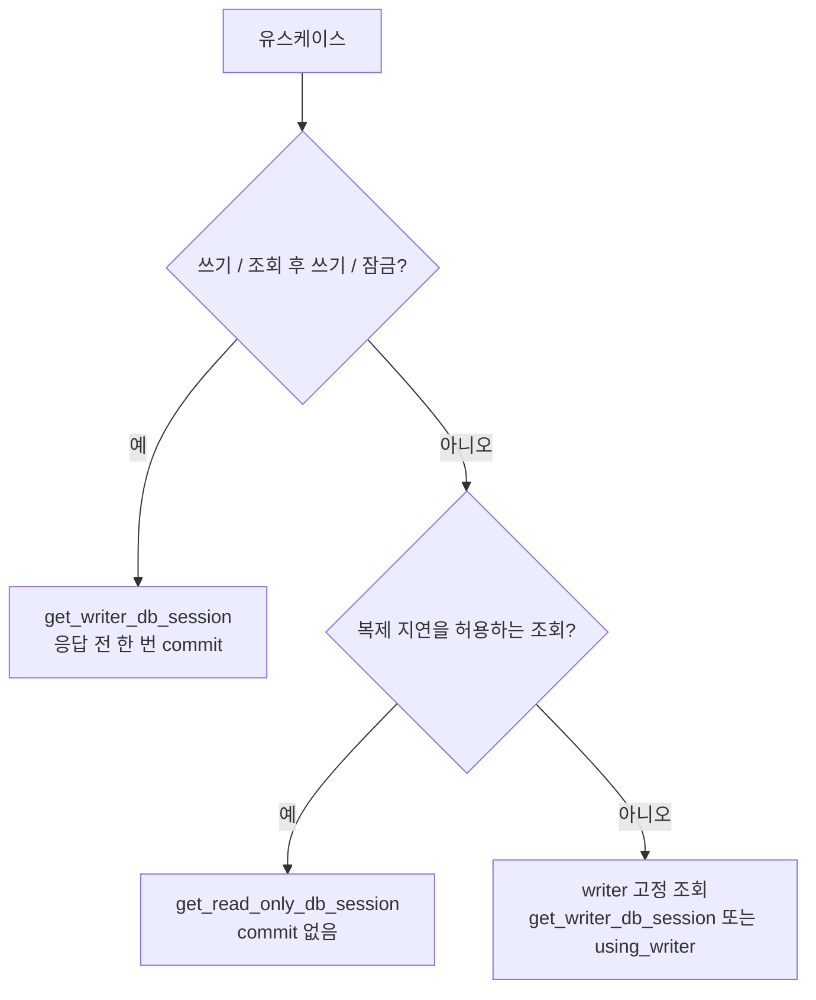
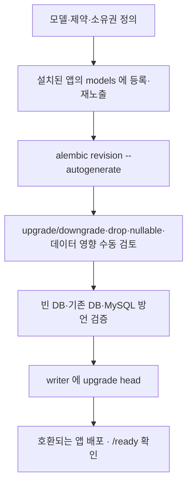

# 개발 가이드

새 기능·API·테이블을 **어떻게 만드는가**와 지켜야 할 규칙을 모았다. 각 구성요소가 어떻게 동작하는지는
[아키텍처 레퍼런스](./ARCHITECTURE.md), 설치·실행은 [README](../../README.md)에 있다.

실물 참조는 두 예제 기능이다 — ORM 은 `app/features/catalog/`, Raw SQL 은 `app/features/reports/`.
같은 흐름을 요청 한 건 단위로 따라 읽는 요약은 [신규 뷰·테이블 개발 안내서](./feature-development-guide.html)다(절차·규칙의 정본은 이 문서).
두 기능은 등록·Dependency·Service·트랜잭션·DTO 검증·예외 처리가 같고 **Repository 만 다르다**(`tests/test_orm_raw_parity.py`).

## 목차

1. [계층 규칙](#1-계층-규칙)
2. [새 기능 추가](#2-새-기능-추가)
3. [ORM 과 Raw 선택](#orm-raw)
4. [세션·트랜잭션·비동기 작성 규칙](#4-세션트랜잭션비동기-작성-규칙)
5. [스키마 변경](#5-스키마-변경)
6. [테스트와 품질 게이트](#6-테스트와-품질-게이트)
7. [문서 유지 규칙](#7-문서-유지-규칙)

---

## 1. 계층 규칙

| 개념 | 이 프로젝트의 위치 | 두지 않는 것 |
|---|---|---|
| Model | `models/models.py` — 테이블·컬럼·제약 | HTTP 응답 계약 |
| 입출력 계약 | `schemas/` — Pydantic 요청·응답 | 테이블 생성 |
| Controller(API view) | `api/routers/v1/<name>.py` — 경로·파라미터·Service 호출·**쓰기 커밋**·응답 DTO | SQL, 업무 규칙 |
| Service | `services/` — `BaseService` 상속, 업무 규칙·Repository 조합 | 중간 커밋, FastAPI 객체 |
| Repository | `repositories/` — `BaseRepository` 또는 `RawRepositoryBase` 상속 | 커밋, HTTP 상태 |
| DI 조립 | `dependencies/` — 세션 선택 후 `Service(session)` 를 **return** | 유스케이스 실행, teardown 커밋 |
| 관리 UI | `admin.py` — ModelView + `admin_views` | API 권한과의 공유(별개다) |

- Router 에서 ORM·SQL 을 직접 쓰지 않는다. Service·Repository 는 커밋하지 않는다.
- 다른 기능을 import 하지 않는다(예외: `auth → user`). `app/core` 에 특정 기능 import 를 추가하지 않는다 — core 에 붙어야 하면 등록 훅을 만든다.
- 요구가 없는데 UnitOfWork·Factory·Strategy·DI 컨테이너를 추가하지 않는다. Service 는 생성자 주입(`Service(session)`)이라 요청 밖·테스트에서도 그대로 쓴다.
- 앱별 로깅 설정은 필요 없다 — `self.log`(`LoggerMixin`) 또는 `get_logger("이름")` 을 쓰면 `app=` 라벨은 경로로 정해진다.
- 선택 모듈의 내부 오류를 삼키지 않는다.

---

## 2. 새 기능 추가

### 2.1 먼저 정할 것

HTTP method/path·입력·공개 응답 필드·권한·읽기/쓰기 의도·데이터 소유·동시성 요구·실패 응답을 먼저 정한다.
기존 기능에 endpoint 만 추가하면 되는 일이라면 새 앱이나 테이블을 만들지 않는다.

### 2.2 골격 생성

```powershell
uv run python -m scripts.new_app orders                              # 기본 골격
uv run python -m scripts.new_app orders --with-models                # + models 골격
uv run python -m scripts.new_app orders --with-models --with-admin   # + admin.py (models 포함)
```

- 이름은 소문자 snake_case Python identifier 여야 한다. 경로 구분자·`..`·절대 경로는 거부하고, 최종 대상이
  resolve 된 `app/features` 밖이면(symlink 포함) 실패한다.
- 임시 디렉터리에 전부 만든 뒤 성공했을 때만 옮긴다. 대상이 이미 있으면 덮어쓰지 않고 실패한다.
- 골격 endpoint 는 `GET /api/v1/<name>/ping` 이며 `operation_id`·`summary` 가 붙어 있어 만든 즉시 OpenAPI 계약 검사를 통과한다.
- **설정 파일을 고치지 않는다.** 생성 직후 앱은 존재하지만 설치되지 않은 상태다.

### 2.3 설치 — `config.INSTALLED_APPS` 에 한 줄

생성기가 출력하는 한 줄을 목록 **끝에** 붙인다(순서가 계약이다).

```python
# config.py
INSTALLED_APPS: list[str] = [
    # 기존 설치 앱 항목은 유지하고 아래 항목을 추가
    "app.features.orders.apps.OrdersConfig",
]
```

이 한 줄이 Router·Models·Admin·`ready()` 를 함께 켠다. `main.py`·`migrations/env.py`·`app/core/db/session.py` 는 손대지 않는다.
미등록 상태에서 어디에도 나오지 않는다는 계약은 `tests/core/apps/test_manual_registration.py` 가 고정한다.

### 2.4 태그 선언

골격 라우터의 태그(`tags=["Orders"]`)는 `app/core/tags_metadata.py` 에 직접 선언한다. 생성기가 붙여 넣을 항목을 출력한다.

```python
{"name": "Orders", "description": "Orders 기능."},
```

생성기가 대신 넣지 않는 이유는 `config.py` 와 같은 중앙 파일이기 때문이다(ADR-S04). 선언하지 않은 태그는
`tests/test_openapi_contract.py` 에서 실패한다.

### 2.5 마이그레이션과 확인

```powershell
uv run alembic revision --autogenerate -m "add orders"   # 모델을 추가했다면 — 생성 결과를 반드시 읽는다
uv run alembic upgrade head
uv run python -m pytest app/features/orders
```

재기동 후 `GET /api/v1/orders/ping` 으로 마운트를 확인한다.

### 2.6 파일 구성

| 파일/디렉터리 | 필수 | 설명 |
|---|---|---|
| `apps.py` | ✅ | `AppConfig` subclass(`name = "app.features.<name>"`). `ready()` 는 process-local 결선만 |
| `__init__.py` | ✅ | 가벼운 package marker — Router·Model 을 import 하지 않는다 |
| `api/routers/router.py` + `api/routers/v1/<name>.py` | 조건부 | 있으면 `<name>_router` 를 공개해야 한다 |
| `models/models.py` + `models/__init__.py` | 조건부 | `models/__init__.py` 에서 매핑 클래스를 **재노출**해야 registry 가 소유권을 수집한다 |
| `schemas/` `services/` `repositories/` `dependencies/` | 기능에 따라 | 데이터·로직 계층. 의존성 파일은 `dependencies/<name>_dependencies.py` |
| `admin.py` | 조건부 | 있으면 `admin_views` 를 공개. **모델이 있는 앱은 필수**(`tests/core/test_admin_wiring.py`) |
| `exceptions.py` | 선택 | 기능 예외(`AppException` 계열 상속) |
| `tests/` | 컨벤션 | registry 가 강제하지 않지만 생성기가 만든다 |

| 용도 | 이름 | 쓰지 말 것 |
|---|---|---|
| 기능 예외 | `exceptions.py` | `<name>_exception.py` |
| SQLAdmin 뷰 | 기능 루트 `admin.py` | `api/<name>_admin.py`, 중앙 취합 파일 |
| FastAPI 의존성 | `dependencies/` 패키지 | `dependency.py` |
| Celery 태스크 | 중앙 `app/celery/tasks.py` | 기능별 `worker/` |

### 2.7 URL 합성

디렉터리 이름으로 URL 을 계산하지 않는다. 세 파일의 prefix 를 더한다.

```text
api/routers/v1/products.py   @router.post("/products")
api/routers/router.py        catalog_router.include_router(products.router, prefix="/v1/catalog", tags=["Catalog"])
AppConfig.router_prefix      "/api"
→ POST /api/v1/catalog/products
```

`API_VERSION` 설정은 prefix 에 쓰이지 않는다. 버전은 `router.py` 의 선언이 정한다.
`operation_id` 는 앱 전체에서 유일해야 하고, `summary`·`description`·`response_model`·`responses` 를 실제 반환과 맞춘다(OpenAPI 계약 검사).

### 2.8 작성 예시

아래는 `<name>` 자리 표시자다. 실물은 catalog 의 같은 위치 파일을 본다.

```python
# models/models.py
from sqlalchemy import String
from sqlalchemy.orm import Mapped, mapped_column
from app.core.models.models_base import Base, TimestampMixin, UUIDPrimaryKeyMixin

class Item(Base, UUIDPrimaryKeyMixin, TimestampMixin):     # 불변 로그라면 CreatedAtMixin 만
    __tablename__ = "<name>_items"
    name: Mapped[str] = mapped_column(String(200), nullable=False)

# models/__init__.py
from app.features.<name>.models.models import Item
__all__ = ["Item"]

# repositories/item_repository.py
class ItemRepository(BaseRepository[Item]):
    model = Item

# services/<name>_service.py
class <Name>Service(BaseService):
    def __init__(self, session: AsyncSession) -> None:
        super().__init__(session)
        self.repository = ItemRepository(session)      # 같은 세션을 넘긴다

    async def create_item(self, data: ItemCreate) -> Item:
        return await self.repository.create(data.model_dump())

# dependencies/<name>_dependencies.py — 조립만 한다(yield·커밋 없음)
async def get_<name>_service(
    session: AsyncSession = Depends(get_writer_db_session),      # 쓰기용
) -> <Name>Service:
    return <Name>Service(session)

async def get_<name>_service_readonly(
    session: AsyncSession = Depends(get_read_only_db_session),   # 조회용
) -> <Name>Service:
    return <Name>Service(session)

# api/routers/v1/<name>.py — 커밋은 여기서
@router.post("/items", response_model=ItemResponse, status_code=201,
             summary="품목 생성", description="새 품목을 생성합니다.", operation_id="create<Name>Item")
async def create_item(
    payload: ItemCreate,
    service: <Name>Service = Depends(get_<name>_service),
) -> ItemResponse:
    item = await service.create_item(payload)
    response = ItemResponse.model_validate(item)   # 응답 검증을 커밋 전에(§4.2 — 모든 쓰기 핸들러의 규칙)
    await service.commit()                         # 예외 시 세션 Dependency 가 rollback
    return response

# api/routers/router.py
<name>_router = APIRouter()
<name>_router.include_router(v1_module.router, prefix="/v1/<name>", tags=["<Name>"])
```

응답 스키마는 `model_config = ConfigDict(from_attributes=True)` 로 ORM 속성을 읽고, 공개할 필드만 선언한다
(모델의 `to_dict()` 를 그대로 내보내면 해시·내부 컬럼이 샌다).

### 2.9 체크리스트

- [ ] `apps.py` + marker `__init__.py`
- [ ] `config.INSTALLED_APPS` 끝에 config class 경로 추가
- [ ] `app/core/tags_metadata.py` 에 태그 선언
- [ ] Router: `<name>_router`, 버전 prefix, 고유 `operation_id`·`summary`·`description`·`response_model`
- [ ] Dependency: 쓰기 `get_<name>_service` / 조회 `get_<name>_service_readonly`
- [ ] 쓰기 핸들러는 응답 전에 한 번 `await service.commit()`
- [ ] 모델: Mixin 조합, `models/__init__.py` 재노출, `admin.py` + `admin_views`, migration 생성·검토
- [ ] 테스트: 기능 `tests/` + 필요한 횡단 검사(§6)
- [ ] 새 route 가 생겼으면 `tests/test_route_inventory.py` 의 골든 목록과 README API 표 갱신

### 2.10 실패 진단

| 증상 | 확인 |
|---|---|
| route 가 404 | `INSTALLED_APPS` 에 있는가, `<name>_router` 이름, prefix 합성, 재기동 |
| 기동 중 `ImproperlyConfigured` | 공개 이름 누락(`<name>_router`·`admin_views`), 중복 name/label, route 충돌(method + 최종 path) |
| 기동 중 `ModuleNotFoundError` | 선택 module **내부**의 import 오류 — 부재로 넘어가지 않는다 |
| 기동 중 `RuntimeError`(재진입) | `ready()` 안에서 `populate()` 호출 |
| 모델이 migration 에 없음 | 앱 설치 여부, `models/__init__.py` 재노출 |
| Admin view 가 없음 | `ADMIN`, 설치 여부, `admin_views` |
| OpenAPI 계약 테스트 실패 | 태그 미선언, `operation_id` 누락·중복, 2xx `response_model` 누락 |

---

<a id="orm-raw"></a>

## 3. ORM 과 Raw 선택

새 기능에서 **가장 먼저 정할 것**이다. 스키마·서비스·라우터·앱 등록의 작성 방식은 같고, 갈라지는 것은 Repository 구현 하나뿐이다.
각 Base 의 공개 API 는 [아키텍처 §4.6](./ARCHITECTURE.md#46-repository-두-계열)에 있다.

| | ORM | Raw SQL |
|---|---|---|
| 상속할 Base | `BaseRepository` | `RawRepositoryBase` |
| 돌려주는 것 | 모델 인스턴스 | `RowMapping` / scalar / rowcount |
| 참조 예제 | `app/features/catalog/repositories/product_repository.py` | `app/features/reports/repositories/sales_report_repository.py` |

### 3.1 기본값은 ORM

먼저 ORM 으로 쓰고, ORM 이 **못 하는 일**이 생겼을 때 Raw 를 꺼낸다. 취향 문제가 아니다 — ORM 경로는 모델이 스키마를
소유해 migration 과 어긋나면 그 자리에서 깨지지만, Raw 경로는 SQL 문자열이 스키마를 몰라 **실행 시점까지 아무도 모른다**.

| 상황 | 선택 | 이유 |
|---|---|---|
| 엔티티 단건·목록 CRUD | ORM | `BaseRepository` 8개 메서드가 이미 있다 |
| 관계를 타고 객체를 다룸 | ORM | 관계 로딩·변경 추적 |
| 여러 테이블 집계·리포트(GROUP BY, 윈도 함수) | Raw | ORM 표현이 SQL 보다 길고 읽기 어려워진다 |
| 대량 조회에서 필요한 컬럼만 | Raw | 엔티티를 만들 이유가 없다 |
| DB 고유 기능 | Raw | ORM 이 추상화하지 않는다 |
| 성능이 실제로 문제 | Raw | **측정한 뒤에** 정한다 |

한 기능 안에서 섞어도 된다. `catalog`/`reports` 의 분리는 기능 단위가 아니라 작업 성격에 따른 것이다.

### 3.2 공통 규칙

- Repository 는 커밋하지 않는다. 트랜잭션 경계는 view 가 소유한다.
- 세션은 **하는 일**로 고른다 — 조회 `get_read_only_db_session()`, 쓰기 `get_writer_db_session()`.
  데이터 접근 방식과는 무관하다(`reports` 는 Raw 지만 조회뿐이라 read-only 만 노출하고, `catalog` 는 ORM 이지만 쓰기에 writer 를 쓴다).
- 결과는 Service 가 Pydantic 으로 검증해서 내보낸다. 결과가 없으면 Service 가 기능 예외(예: `ProductNotFoundException`)로 바꾼다.
- 외부 요청의 컬럼명·정렬식·SQL 조각을 그대로 전달하지 않는다. 입력 dict 는 `model_dump(exclude_unset=True)` 등으로 통제한다.
- 도메인 쿼리는 기능 Repository 에 명시적 메서드로 둔다. 문자열 컬럼명을 받는 범용 필터를 늘리지 말고 모델 속성을 쓴다.

### 3.3 Raw 를 골랐을 때 추가 규칙

어기면 AST 검사와 테스트(`tests/core/test_raw_repository_base.py`, `tests/core/test_raw_routing.py`)가 실패한다.

1. **SQL 은 `text()` 로 만든 `TextClause`, 모듈 상수로 둔다.** 메서드 안에서 문자열을 조립하지 않는다.
2. **외부 값은 전부 named bind parameter**(`:start_at`). f-string·`%`·`.format()`·문자열 연결 금지.
   테이블·컬럼·정렬 방향처럼 바인딩할 수 없는 식별자는 요청값을 넣지 않고 코드가 소유한 고정 SQL 이나 allowlist 로 고른다.
3. **`query_name` 은 코드 상수.** `feature.use_case` 형식(소문자·숫자·밑줄, 점 하나, 64자 이하)이며 어기면 실행 전에
   `InvalidQueryNameError`. 로그 라벨이라 요청값이 섞이면 cardinality 가 폭발하고 값이 샌다.
4. **읽기/쓰기 의도는 Base 가 붙인다.** `fetch_*` 는 읽기, `execute` 와 `for_update=True` 는 쓰기다. read-only 세션에서 쓰기는
   `DB_ROUTER_ENABLED` 와 무관하게 **실행 전에** `ReadOnlyRoutingError`. 잠금 읽기(SELECT ... FOR UPDATE)는 `for_update=True` —
   replica 에서 잡은 잠금은 아무것도 보호하지 않는다.
5. **방언 함수를 SQL 에 넣지 않는다.** 단위 테스트는 SQLite, 운영은 MySQL 이다. 날짜 상한은 MySQL 전용 날짜 함수 대신 Service 가 계산한 배타 상한을 바인딩한다.

자주 틀리는 지점:

- **`updated_at` 이 갱신되지 않는다** — `UpdatedAtMixin.onupdate` 는 ORM UPDATE 에만 적용된다. Raw INSERT/UPDATE 는 PK·시각·기본값을 SQL 에 직접 쓴다.
- **반환 타입이 DB 마다 다르다** — 같은 컬럼이 SQLite 에서 `str`·`float`, MySQL 에서 `date`·`Decimal`. `RowMapping` 을 그대로 흘리지 말고 DTO 로 검증한다. 값 정확성은 MySQL 통합 테스트가 승인한다.
- **`execute()` 의 rowcount 로 존재를 판단하지 않는다** — 드라이버 설정에 따라 의미가 달라진다. 존재는 조회로 판단한다.
- **도메인 SQL 을 Base 에 두지 않는다** — Base 가 한 기능의 쿼리를 알기 시작하면 모든 기능이 Base 를 통해 결합된다.
- Raw 는 "항상 빠름"도, "Schema·Service 불필요"도 아니다. SQL 안전 검사는 DB 권한·실행 계획을 대신하지 않는다.

### 3.4 ORM 예제 — catalog 상품 생성 한 요청

```text
POST /api/v1/catalog/products
 → get_catalog_service: get_writer_db_session → CatalogService(session) → ProductRepository(session)
 → create_product(payload) → repository.create(payload.model_dump())
     → CRUDBase._add: session.add → await flush(INSERT·기본값·제약 확인) → await refresh
 → view: response = ProductResponse.model_validate(product)   # 검증이 실패하면 커밋하지 않는다
 → view: await service.commit() → return response → 201
```

- `Product` 는 `catalog_products`, `sku` unique, 금액은 `Numeric(12, 2)` ↔ `Decimal`. API 는 price·stock 에 `ge=0` 을 두지만 DB 선언이 같은 규칙을 강제하지는 않는다 — 입력은 스키마, 동시성 상황의 최종 무결성은 DB 제약이 지킨다.
- 도메인 조회 `ProductRepository.get_active()` 는 `order_by(Product.sku)` 로 정렬한다. `active_only=false` 목록은 정렬 없는 `get_all()` 을 쓰고(OpenAPI 설명도 그렇게 적는다), `total` 은 필터와 무관한 전체 `count()` 다 — 새 기능은 같은 필터로 total 을 세고 고정 정렬(동률은 PK)을 명시한다.
- 수정은 대상 조회로 존재를 보장한 뒤 `model_dump(exclude_unset=True)` 로 보낸 필드만 반영한다. 보낸 필드가 없으면 기존 값을 그대로 돌려준다(`tests/test_update_noop.py`).

### 3.5 Raw 예제 — reports 일별 매출

```text
GET /api/v1/reports/daily-sales?start_date=2026-08-01&end_date=2026-08-07
 → get_report_service_readonly: get_read_only_db_session → ReportService
 → 기간 검증(종료 ≥ 시작, 최대 366일) → end_exclusive = end_date + 1일
 → SalesReportRawRepository.daily_sales(...)  fetch_all  query_name="sales_report.daily_sales"
   SalesReportRawRepository.order_count(...)  fetch_scalar query_name="sales_report.order_count"
 → [DailySalesItem.model_validate(dict(row)) ...] → DailySalesReportResponse (커밋 없음)
```

```python
_DAILY_SALES_SQL = text("""
    SELECT DATE(o.ordered_at) AS sales_date, COUNT(*) AS order_count,
           COALESCE(SUM(o.total_amount), 0) AS gross_amount
    FROM sales_orders AS o
    WHERE o.ordered_at >= :start_at AND o.ordered_at < :end_exclusive AND o.status = :status
    GROUP BY DATE(o.ordered_at) ORDER BY sales_date ASC
""")
```

- ORM 조회 흐름과 다른 곳은 Repository 한 줄뿐이다.
- API 의 `end_date` 는 **포함**, SQL 은 `< :end_exclusive` **미포함**. 변환을 Python 에서 하므로 같은 SQL 이 SQLite 와 MySQL 에서 그대로 돈다 — 경계 조건을 SQL 밖으로 빼면 방언에서 자유로워진다.
- 집계 대상 상태(`paid`)는 요청값이 아니라 코드 상수다.
- `SalesOrder` 모델은 있지만 Repository 는 import 하지 않는다. 모델의 역할은 **스키마 소유권**(registry·Alembic 이 `sales_orders` 를 이 앱의 것으로 인식)이다. Raw 기능도 테이블을 소유하면 모델을 두고, 남의 테이블을 읽기만 하면 두지 않는다(그 경우 drift 제외 정책을 먼저 설계한다).
- read-only 세션에서의 Raw DML 거부는 `app/features/reports/tests/test_raw_dml_workflow.py` 가 고정한다.
- 이 기능은 DB 의 SQL VIEW 객체를 만들지 않는다. 집계 결과는 영속 모델이 아니라 DTO 다.

---

## 4. 세션·트랜잭션·비동기 작성 규칙

### 4.1 세션 선택



HTTP 메서드 이름만으로 판단하지 않는다. 한 원자 작업에 여러 Service 가 참여하면 같은 writer 세션을 주입하고 커밋 주체를 하나로 둔다.
인증(`get_current_user`)은 read-only 세션을 따로 쓰므로, 인증 단계에서 읽은 객체를 쓰기 세션에서 수정하려면 쓰기 세션에서 다시 조회한다.

### 4.2 커밋과 응답

- 쓰기 view 는 성공 응답을 만들기 전에 **정확히 한 번** 커밋한다. 조회 Dependency 는 커밋하지 않는다.
- 순서는 **응답 DTO 검증 → commit → 반환** 하나다(§2.8). 모든 기능의 생성·수정 핸들러가 이 순서를 따른다.
  반대로 하면 DTO 검증 실패가 500 을 내는데 데이터는 이미 커밋돼 남는다. 회귀 가드: `tests/test_validate_before_commit.py`
  (전 기능의 생성·수정 핸들러에서 DTO 검증을 실패시켜 500·커밋 0회·DB 불변을 확인). 커밋을 Dependency teardown 에 두지 않는다.
- DTO 가 접근할 관계·컬럼은 Repository 에서 명시적으로 로드한다. 커밋 이후나 DTO 검증 중 lazy load 가 암묵 I/O 를 일으키지 않게 한다
  (`expire_on_commit=False` 가 모든 관계 로딩을 해결하지는 않는다).
- PATCH 스키마의 `None` 은 "미전달"과 다르다. `exclude_unset=True` 는 안 보낸 필드만 뺀다 — 명시적 null 을 허용할지 거부할지 정하고 테스트한다.
- 상태 전환·재고 차감처럼 동시성이 있는 변경은 "조회 후 UPDATE" 만으로 안전하지 않다. 조건부 UPDATE·잠금·DB 제약을 설계한다.
- 커밋 성공 뒤 응답이 유실될 수 있다. 중요한 생성 업무는 멱등 키·중복 처리 정책을 정한다.

### 4.3 N+1 과 목록

Eager loading·집계·정렬 목록은 Base 가 아니라 기능 Repository 에 둔다.

```python
class UserRepository(BaseRepository[User]):
    model = User

    async def get_all_with_posts(self, *, skip: int = 0, limit: int = 50) -> Sequence[User]:
        stmt = (
            select(User)
            .options(selectinload(User.posts))   # 1:N 은 selectinload 가 기본
            .order_by(User.id)                   # 정렬 없는 pagination 은 페이지가 겹친다
            .offset(skip)
            .limit(limit)
        )
        return (await self.session.execute(stmt)).scalars().all()
# joinedload: 1:1 / 작은 N:1, subqueryload: 복잡한 관계
```

(예시의 `User.posts` 관계는 현재 모델에 없다 — 패턴 설명용이다.)

### 4.4 비동기 원칙

- `async def` 는 await 하는 I/O 동안 다른 요청을 진행시킬 뿐, CPU 연산이나 동기 SDK 를 비동기로 바꾸지 않는다.
  async endpoint 에서 `time.sleep`·동기 HTTP·큰 파일 처리·무거운 CPU 루프를 직접 돌리지 않는다. 짧은 CPU 작업(JWT·Pydantic·User-Agent 파싱)은 그대로 두고,
  bcrypt 처럼 비싼 것은 `asyncio.to_thread` 로 뺀다. 무거운·내구성이 필요한 작업은 Celery 로 보낸다.
- 같은 `AsyncSession` 으로 `asyncio.gather` 하지 않는다. 한 트랜잭션의 SQL 은 순차 await, 독립 병렬 작업은 작업별 세션을 연다.
- 요청의 세션·Service·Request 를 백그라운드나 Celery 로 넘기지 않는다. 요청 밖에서는 직접 조립한다.

```python
async with background_session() as session:     # 요청 밖 — 커밋은 직접
    await SomeService(session).do_write()
    await session.commit()
```

- Celery 태스크는 `app/celery/tasks.py` 에 두고 `run_async()` 로 코루틴을 돌린다. 인자는 JSON 직렬화 가능한 값만. 재시도·중복·커밋과 enqueue 사이 실패를 테스트한다.
- 접속 로그 runner(`access_log_tasks`)는 drop 가능한 비핵심 작업 전용이다. 업무 저장·결제·발송을 넣지 않는다.
- `app.state.redis` 는 기동 검증용 client 다. 새 기능이 Redis 를 쓰려면 lifecycle 상태를 확인하는 작은 Dependency 를 만들고 장애 시 오류 계약을 정한다.

---

## 5. 스키마 변경



```powershell
uv run alembic revision --autogenerate -m "add <name> items"
uv run alembic upgrade head
uv run alembic current
uv run alembic heads          # 항상 1개여야 한다 (CI 검사)
```

- autogenerate 결과는 후보다. rename 을 감지한다고 가정하지 않고, 인덱스·FK·기본값·기존 데이터 영향을 읽는다.
- `DEBUG=true` 의 `create_all` 은 migration 을 대신하지 않는다. 이미 `create_all` 로 만든 개발 DB 에 실데이터가 있으면 drop/recreate 나 검증 없는 `stamp head` 를 하지 않는다(`stamp` 는 테이블을 만들지 않고 drift 를 숨긴다).
- 컬럼 순서는 Mixin 의 `sort_order` 가 고정한다. 새 Mixin 을 만들면 같은 규칙을 지킨다.
- SQL VIEW 가 필요하면 방언에 맞는 CREATE/DROP VIEW 를 명시 migration 으로 관리한다. Alembic 이 VIEW 정의 변경을 자동 추적하지 않는다.
- 운영 호환 배포(확장 → 코드 전환 → 구 컬럼 제거)는 데이터·동시 운영 요구가 있을 때 단계로 나눈다.
- 앱을 목록에서 빼면 autogenerate 가 DROP TABLE 을 제안할 수 있다 — [아키텍처 §2.7](./ARCHITECTURE.md#27-앱-비활성화제거-시-주의).

---

## 6. 테스트와 품질 게이트

### 6.1 명령

```powershell
uv sync                                                          # 의존성 (dev 그룹 포함)
uv run python -m pytest -m "not mysql and not browser"           # 외부 인프라 불필요 — CI 기본 job 과 같은 범위
uv run ruff check .
uv run ruff format --check .
uv run mypy .
uv run python -m scripts.bandit_gate                             # Bandit MEDIUM 이상
uv run python -m scripts.review_gate                             # 아래 9단계 일괄 (--fast: ⑧⑨ 제외, --list: 목록만)
```

- `pytest` 콘솔 스크립트가 아니라 **`python -m pytest`** 를 쓴다(다른 인터프리터를 집어 import 가 어긋난 전례).
- 단위 테스트는 in-memory SQLite 와 가짜 Redis 를 쓴다. `pyproject.toml` 이 `DEBUG=true`, `ENV=test` 를 주입하고 `tests/`·`app/` 의 `test_*.py` 를 수집한다(strict marker).
- 임시 경로를 저장소 안에 두지 않으려면 `--basetemp <경로>`, `mypy --cache-dir <경로>` 를 준다. **게이트 판정용 mypy 는 콜드 캐시** 결과만 유효하다(CI 는 캐시를 복원하지 않는다).
- 마커를 빼지 않으면 `mysql` 테스트는 MySQL 이 없을 때 skip 되지만 `browser` 테스트는 skip 없이 **실패**한다.

| 마커 | 준비 | 실행 |
|---|---|---|
| `mysql` | `docker compose -f compose.test.yaml up -d --wait` (MySQL 8.4, `127.0.0.1:3309` — 포트는 환경변수 MYSQL_TEST_PORT 로 변경, tmpfs) | `uv run python -m pytest -m mysql` → 끝나면 `docker compose -f compose.test.yaml down -v` |
| `browser` | `uv run python -m playwright install chromium` + 위 MySQL + startup ping 이 통과할 Redis(기본 `localhost:6379`, compose 파일에는 Redis 가 없다) | `uv run python -m pytest -m browser` — 실제 uvicorn 을 `DEBUG=true` 로 띄워 Scalar 렌더링 확인 |

`review_gate` 단계: ① ruff format ② ruff check ③ mypy ④ bandit ⑤ pip-audit(`--strict`) ⑥ pytest(인프라 제외)
⑦ OpenAPI 규칙 fail-on-revert(`scripts/openapi_revert_check.py`) ⑧ pytest `-m mysql`(skip 금지) ⑨ pytest `-m browser`(skip 금지).
`--fast` 는 ⑧⑨ 을 빼고 실행하지 않았다는 경고를 남긴다. 의존성 감사는 외부 인프라가 필요 없고 몇 초면 끝나므로
`--fast` 에도 남긴다 — 코드가 그대로여도 권고는 새로 뜨고, 그걸 전체 게이트를 돌릴 때까지 몰라야 할 이유가 없다.
도구 stdio 는 UTF-8 로 고정하고 실행별 임시 경로를 쓴다.

**CI** (`.github/workflows/ci.yml`) — 판정 규칙의 정본은 `scripts/review_gate.py` 이며 두 파일을 함께 고친다.

| job | 내용 |
|---|---|
| gate | `uv sync --frozen` → ruff check·format → mypy(콜드 캐시) → bandit gate → pip-audit(`--strict`) → pytest 커버리지 85% 이상(`-m "not mysql and not browser"`) → skipped·xfailed·xpassed 0건 확인 → alembic 단일 head → SQLite `upgrade head` + `alembic check` |
| mysql | compose 기동 → `upgrade head` → `downgrade -1` → 재-upgrade → `alembic check` → `pytest -m mysql`(skip·0건이면 실패) → Chromium 설치 → `pytest -m browser`(skip·0건이면 실패) → `down -v` |

### 6.2 테스트 위치

기능 테스트는 `app/features/<name>/tests/`, 여러 기능·core 계약을 보는 테스트는 최상위 `tests/`(`core/`·`core/apps/`·`integration/`·`browser/`·`scripts/`·`utils/`).
Endpoint 테스트는 `dependency_overrides` 로 세션·Service 를 바꾸고 종료 시 복원한다. lifespan 을 검증할 때는 `app.router.lifespan_context` 처럼 실제 context 에 진입한다 — ASGITransport 요청만으로 startup 이 검증되지 않는다.

### 6.3 구조 계약을 지키는 테스트

| 계약 | 테스트 |
|---|---|
| 미등록 앱은 route·모델·Admin·`ready()` 어디에도 없다 | `tests/core/apps/test_manual_registration.py` |
| 등록 순서 보존, 중복 name·label 거부 | `tests/core/apps/test_population_order.py` · `tests/core/apps/test_registry_errors.py` |
| 선택 module 부재 vs 내부 import 실패 | `tests/core/apps/test_optional_modules.py` |
| 컨벤션 결선과 route 충돌 | `tests/core/apps/test_wiring.py` |
| registry core 가 웹 스택에 의존하지 않음 / `ADMIN=false` 에서 sqladmin 미로드 | `tests/core/apps/test_core_independence.py` · `tests/core/test_admin_lazy_loading.py` |
| `ready()` 에 I/O 없음 | `tests/core/apps/test_installed_apps.py` |
| 공개 route 골든 목록 | `tests/test_route_inventory.py` |
| OpenAPI 계약(operationId·태그·응답 모델·스키마 이름) | `tests/test_openapi_contract.py` · `tests/test_layering_and_openapi.py` |
| 계층 의존 방향 | `tests/test_layering_and_openapi.py` |
| 조회 경로는 커밋 0회 / 쓰기는 1회 | `tests/test_read_path_no_commit.py` · 기능별 `test_transaction_boundary.py` |
| 쓰기 핸들러는 응답 DTO 검증 후 커밋 | `tests/test_validate_before_commit.py` |
| ORM·Raw 예제는 Repository 만 다르다 | `tests/test_orm_raw_parity.py` |
| migration metadata == 등록 모델, 체인·스키마 일치 | `tests/core/test_alembic_metadata.py` · `tests/core/test_migration_chain.py` |
| 설정 계약·`.env.example` 일치 | `tests/core/test_settings_contract.py` |
| staging/production 비밀키 placeholder·access=refresh 거부(import 시점) | `tests/core/test_deployment_safety.py` |
| 자원 수명(Redis·DDL·종료 순서) | `tests/core/test_bootstrap.py` · `tests/core/test_runtime_lifecycle.py` |
| SQL·비밀값 비노출, 500 불투명 | `tests/core/test_security_hardening.py` · `tests/core/test_db_error_conversion.py` |
| 생성기 동작·경계 | `tests/scripts/test_new_app.py` |
| 문서가 코드와 어긋나지 않음 | `tests/test_docs_consistency.py` · `tests/test_docs_references.py` |

### 6.4 변경 유형별 최소 검증

| 변경 | 최소 검증 |
|---|---|
| 새 AppConfig·Router | registry·wiring·route inventory·OpenAPI 계약·기능 테스트 |
| Model·Repository | 기능 DB 테스트, `tests/core/test_repository_base.py`, migration chain, `alembic check` |
| Raw SQL | `tests/core/test_raw_repository_base.py`·`tests/core/test_raw_routing.py`, MySQL 통합(방언·Decimal·날짜·rowcount) |
| 세션·DB Router | transaction boundary, `tests/test_read_path_no_commit.py`, `tests/core/test_db_router.py`·`tests/core/test_db_router_env.py` |
| 인증 | auth endpoint, `tests/utils/test_auth.py`, `tests/test_email_validation.py` |
| Middleware | `tests/core/test_access_log_decoupling.py`, `tests/core/test_background_tasks.py`, `tests/core/test_cors_settings.py` |
| 설정 | `tests/core/test_settings_contract.py`·`tests/core/test_deployment_safety.py`, `.env.example` 동시 갱신 |
| 문서 | 문서 검사 두 파일 |

### 6.5 새 기능의 테스트 범위

| 범위 | 시나리오 |
|---|---|
| Schema | 필수값·길이·금액·음수·null vs 미전달·공개 응답 필드 |
| Service | 업무 분기·부재·범위·상태 전환 |
| Repository | flush 까지·커밋 없음·바인딩·필터·정렬·count·오류 변환 |
| Endpoint | 201/200/204·404/409/422/500·`operation_id`·권한·응답 DTO |
| 트랜잭션 | 커밋 실패 시 2xx 없음·중간 실패 rollback·DTO 검증 실패 |
| 등록 | 설치·미설치·잘못된 공개 이름·중복 path |
| 비동기·수명 | 요청 세션을 백그라운드에 넘기지 않음·취소·timeout |
| 실제 DB | MySQL Decimal·날짜·제약·잠금·동시 수정·Raw 방언·migration |

SQLite 통과는 MySQL 정확성의 근거가 아니다(ADR-004). 인프라가 없어 skip·미실행인 것은 검증된 것이 아니다.

---

## 7. 문서 유지 규칙

| 문서 | 소유 주제 | 고칠 때 |
|---|---|---|
| `README.md` | 개요·빠른 시작·프로젝트 구조·API 목록·문서 색인 | route·실행 절차·트리 변경 |
| `docs/guides/ARCHITECTURE.md` | 동작 레퍼런스·운영·변경 이력 | 코드 동작·설정·보안 경계 변경 |
| `docs/guides/DEVELOPMENT.md` | 작성 절차·규칙·테스트 | 생성기·규칙·게이트 변경 |
| `docs/guides/server-lifecycle-guide.html` | 설정 → 기동 → 요청 → 종료 흐름 요약(HTML) | 수명주기·설정·로깅·종료 순서 변경 — ARCHITECTURE 와 함께 |
| `docs/guides/feature-development-guide.html` | 신규 뷰·테이블 흐름 요약(HTML) | Repository·세션·트랜잭션·생성기 절차 변경 — DEVELOPMENT 와 함께 |
| `docs/specs/orm-raw-repository/` | 착수 기준선(고정) | 고치지 않는다 — 코드 주석의 `development-plan §N`·`RAW-REP-*` 인용 대상 |
| `docs/crp/groups/` | 검수 기록(append-only) | 새 결정은 행을 추가한다 |

- 같은 내용을 두 문서에 쓰지 않는다. 필요하면 링크한다. HTML 안내서는 흐름 요약이며 표·수치는 Markdown 을 링크하거나 같은 값을 쓴다.
- 문서 색인은 README 「문서 안내」 한 곳뿐이다. 문서를 추가·삭제하면 그 표와 `tests/test_docs_references.py` 의 DOC_INDEX_ORDER 를 함께 고친다.
- HTML 본문의 `<`·`>` 는 `&lt;`·`&gt;` 로 쓴다. 다른 저장소와의 비교는 쓰지 않는다(이력은 `docs/crp/` 에만).
- 코드와 문서가 다르면 코드를 확인한 뒤 문서를 고친다. 과거 서술은 ARCHITECTURE 의 변경 이력에만 둔다.
- 문서 검사는 세 Markdown 문서의 import 경로·심볼·환경변수·저장소 경로·링크·앵커 실재, HTML 안내서의 `<code>` 경로·`data-source`·상대 링크·앵커·꺾쇠 이스케이프·부록 설정 목록, 제거된 결선 방식·옛 등록 절차의 부재,
  `INSTALLED_APPS` 예제와 생성기 출력의 일치, 학습 경로(Raw Base·두 예제·이 문서의 [ORM/Raw 절](#orm-raw))의 도달 가능성을 본다.
  백틱 안의 대문자 토큰은 `.env.example` 에 있는 키로 해석되므로, 환경변수가 아닌 대문자 단어(HTTP 메서드·SQL 키워드 등)는 백틱 없이 쓴다.
