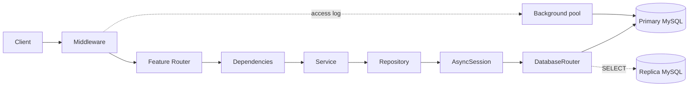
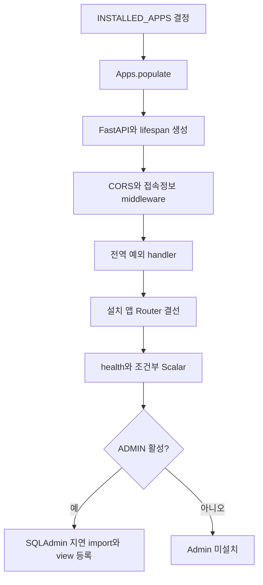

# 시스템 설계

| 항목 | 값 |
|---|---|
| 문서 버전 | 1.0.0 |
| 작성일 | 2026-08-18 |
| 대상 프로젝트 | fastapi-default-project-structure 0.1.0 |
| 적용 코드 기준 | Git `9c93803` |

## 1. 설계 목표

이 구조는 기능을 수동으로 설치하고, 설치된 기능만 런타임·마이그레이션·관리 화면에 포함하는 것을 목표로 한다. 기능별 코드를 한 패키지에 응집시키면서 공통 인프라와 도메인의 결합을 최소화한다.

## 2. 논리 아키텍처

의존 방향은 외부 입력에서 데이터 계층으로 향한다. Repository가 Router를 알거나 core가 특정 기능 앱의 내부 구현을 직접 import하는 구조는 피한다. 접속 로그는 `AccessLogSink` Protocol로 core middleware와 home 도메인을 분리한다.

## 3. 계층별 책임

| 계층 | 책임 | 하지 않아야 할 일 |
|---|---|---|
| Router | HTTP 입력·출력, DI, 응답 전 명시적 커밋 | SQL 작성, 복잡한 비즈니스 규칙 |
| Dependencies | 세션 종류 선택, Service 조립, 인증 사용자 해석 | 응답 후 커밋 |
| Service | 유스케이스, 도메인 규칙, Repository 조합 | FastAPI Request/Response 의존 |
| Repository | SQLAlchemy 조회·저장·수정·삭제 | HTTP 상태 결정, 트랜잭션 최종 커밋 |
| Model/Schema | 영속성 구조와 외부 데이터 계약 | 애플리케이션 조립 |
| Core | 앱 로딩, DB, middleware, 예외, 공통 기반 | 기능 디렉터리 자동 탐색 |

## 4. 앱 Registry 설계

`AppConfig`는 앱 package의 정규 표현이다. 기본 결선 규칙은 다음 속성으로 정의된다.

| 속성 | 기본값/규칙 |
|---|---|
| `name` | 앱의 전체 package 경로, subclass 필수 |
| `label` | package 마지막 조각 |
| `router_module` | `api.routers.router` |
| `router_attribute` | `<label>_router` |
| `models_module` | `models` |
| `admin_module` | `admin` |
| `router_prefix` | `/api` |

Registry population은 `config → models → ready()`의 3단계다. `Apps.populate()`는 재진입을 거부하고 완료 후 반복 호출에는 멱등적으로 동작한다. 선택 모듈이 실제로 없으면 건너뛰지만, 모듈 내부 import 오류나 필수 공개 이름 누락은 기동 실패로 처리한다.

## 5. 런타임 조립 경계

`main.py`는 `create_app()`을 호출하는 얇은 진입점이다. 실제 조립은 `app/core/bootstrap.py`가 담당한다.

SQLAdmin import는 Admin 생성 함수 내부에서 지연된다. 따라서 `ADMIN=false`인 프로세스는 SQLAdmin과 앱별 `admin.py`를 로드하지 않는다.

## 6. 데이터 설계

- 모든 모델은 공통 `Base` metadata에 등록된다.
- 현재 영속 모델은 `User`, `Post`, `Reply`, `SnsPost`, `UserAccessLog`다.
- Alembic은 별도 `Apps()` 인스턴스로 `INSTALLED_APPS`를 `run_ready=false`로 채운 뒤 동일한 `Base.metadata`를 사용한다.
- 개발용 `DEBUG=true` 시작에서는 `create_all`을 수행한다.
- 운영에서는 `DEBUG=false`로 자동 생성을 끄고 Alembic revision을 적용해야 한다.

## 7. 트랜잭션 설계

Repository는 데이터를 조작하고 필요할 때 flush하지만 최종 커밋을 소유하지 않는다. 쓰기 Router가 `await service.commit()`을 응답 생성 전에 호출한다. 예외가 발생하면 세션 dependency가 rollback한다.

이 경계는 커밋 실패 후 성공 응답이 이미 전송되는 문제를 방지한다. 조회 Router는 읽기 전용 Service dependency를 사용하며 커밋하지 않는다.

## 8. 비동기 작업 설계

요청 후 접속 로그 저장은 별도 background 엔진과 `BackgroundTaskRunner`를 사용한다. runner는 최대 동시 작업 수 256을 적용하고 초과 작업을 드롭·집계한다. shutdown에서는 최대 5초간 진행 중 작업을 drain한 다음 모든 DB 엔진을 dispose한다.

Celery 작업도 중앙 `app/celery/` 패키지에 모으며, `background_session()`으로 요청 밖 세션을 연다.

## 9. 확장 원칙

새 기능은 `python -m scripts.new_app <name>`으로 골격을 만들 수 있다. 생성기는 `config.py`를 자동 수정하지 않는다. 개발자가 변경 내용을 검토한 뒤 `INSTALLED_APPS`에 config class를 추가해야 기능이 설치된다.

## 10. 관련 문서

- [앱 등록 및 기동 워크플로](05-app-registry-and-startup-workflow.md)
- [데이터 접근 및 트랜잭션 워크플로](06-data-and-transaction-workflow.md)
- [기존 상세 아키텍처](../../ARCHITECTURE.md)

## 변경 이력

| 문서 버전 | 작성일 | 변경 내용 |
|---|---|---|
| 1.0.0 | 2026-08-18 | 계층, Registry, 조립, 데이터와 비동기 설계 최초 정리 |
