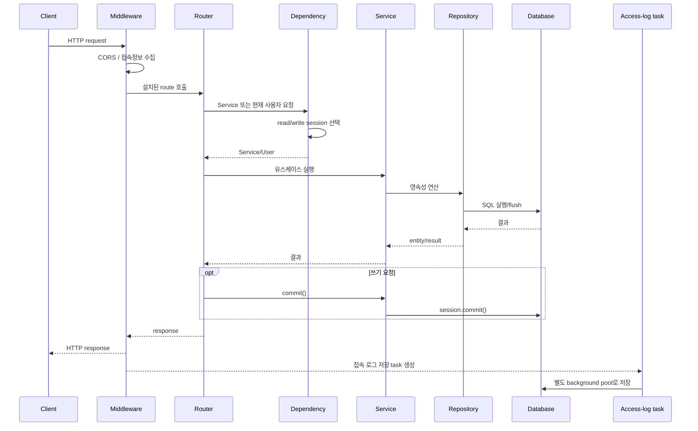
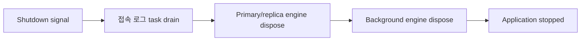

# 전체 요청 워크플로

| 항목 | 값 |
|---|---|
| 문서 버전 | 1.0.0 |
| 작성일 | 2026-08-18 |
| 대상 프로젝트 | fastapi-default-project-structure 0.1.0 |
| 적용 코드 기준 | Git `9c93803` |

## 1. 전체 흐름

## 2. 요청 진입

1. Uvicorn이 `main:app`으로 요청을 전달한다.
2. CORS middleware가 preflight와 응답 header 정책을 적용한다.
3. 접속 로그가 활성화되어 있고 제외 경로·확장자가 아니면 `UserInfoMiddleware`가 요청 정보를 수집한다.
4. Registry가 설치한 Router에서 method와 path가 일치하는 handler를 선택한다.
5. FastAPI가 path, query, body, form, header와 dependency를 검증·해석한다.

## 3. 조회 요청

대표 흐름은 `GET /api/v1/blog/posts`다.

1. Router가 `get_blog_service_readonly`를 요청한다.
2. dependency가 `get_read_session()`으로 `AsyncSession`을 열고 `BlogService`를 만든다.
3. Service가 `PostRepository`에 페이지 조회를 위임한다.
4. DB Router가 활성화되고 replica가 구성되어 있으면 SELECT는 해당 세션에 고정된 reader로 간다.
5. 결과는 Pydantic response model로 직렬화된다.
6. 조회 경로는 `commit()`을 호출하지 않는다.
7. 예외가 있으면 dependency가 rollback하고 전역 handler가 오류 응답을 만든다.

## 4. 쓰기 요청

대표 흐름은 `POST /api/v1/blog/posts`다.

1. 요청 body가 `PostCreate` schema로 검증된다.
2. `get_blog_service`가 일반 요청 세션으로 Service를 만든다.
3. Service가 Repository의 `create()`를 호출한다.
4. Repository가 model을 추가하고 flush하여 DB 생성값을 확보한다.
5. Router가 `await service.commit()`을 명시적으로 호출한다.
6. 커밋 성공 후에만 201 응답 model이 생성된다.
7. 커밋 또는 처리 중 예외가 발생하면 세션 dependency가 rollback한다.

수정과 삭제도 같은 경계를 사용한다. 존재하지 않는 리소스는 기능별 Not Found 예외로 변환된다.

## 5. 인증 요청

### 로그인

1. `/api/v1/auth/login`이 OAuth2 password form을 받는다.
2. `AuthService`가 username으로 사용자를 조회한다.
3. bcrypt로 비밀번호를 검증하고 활성 여부를 확인한다.
4. Access Token과 Refresh Token을 발급해 반환한다.

### 보호된 요청

1. `OAuth2PasswordBearer`가 Authorization header에서 Bearer token을 읽는다.
2. `decode_token()`이 access secret, algorithm, 만료, token type을 검증한다.
3. subject로 사용자를 읽기 전용 세션에서 조회한다.
4. 사용자가 존재하고 활성 상태면 handler에 전달한다.
5. 실패하면 공통 401 응답으로 처리한다.

## 6. 오류 흐름

| 오류 출처 | 처리 |
|---|---|
| 기능/비즈니스 예외 | `AppException` handler가 status와 error code 유지 |
| 요청 검증 실패 | field·message·type 목록을 포함한 검증 오류 응답 |
| FastAPI/Starlette HTTP 예외 | `HTTP_<status>` 형식으로 정규화 |
| 예상하지 못한 예외 | 500 응답, DEBUG가 아니면 상세 숨김 |

## 7. 접속 로그 후처리

응답 handler가 끝나면 middleware는 상태 코드와 처리 시간을 수집 데이터에 합친다. `BackgroundTaskRunner.spawn()`이 작업을 수락하면 home 앱이 등록한 sink가 별도 background session으로 `UserAccessLog`를 저장하고 커밋한다.

동시 작업이 256개에 도달하면 새 로그 작업은 요청을 지연시키지 않고 드롭되며 누적 횟수가 기록된다. 로그 저장 실패 역시 원래 요청 응답에는 영향을 주지 않는다.

## 8. 종료 시 흐름

## 9. 관련 문서

- [데이터 접근 및 트랜잭션 워크플로](06-data-and-transaction-workflow.md)
- [기능별 워크플로](07-feature-workflows.md)

## 변경 이력

| 문서 버전 | 작성일 | 변경 내용 |
|---|---|---|
| 1.0.0 | 2026-08-18 | 조회·쓰기·인증·오류·접속 로그의 전체 요청 흐름 최초 정리 |
