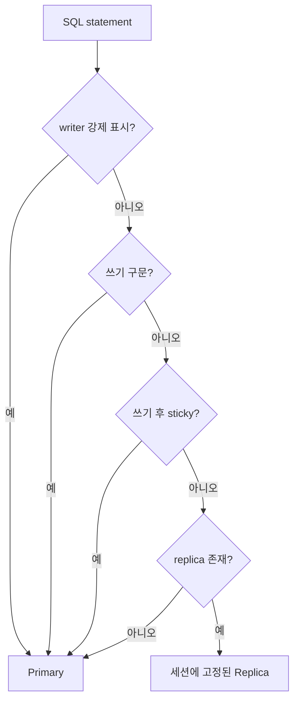
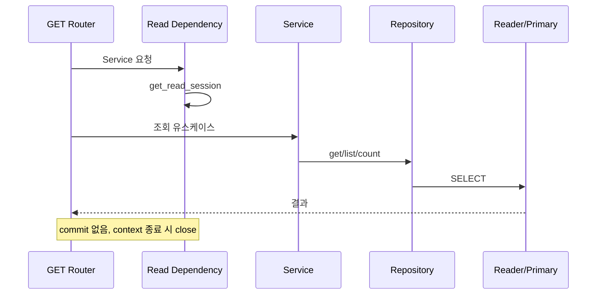
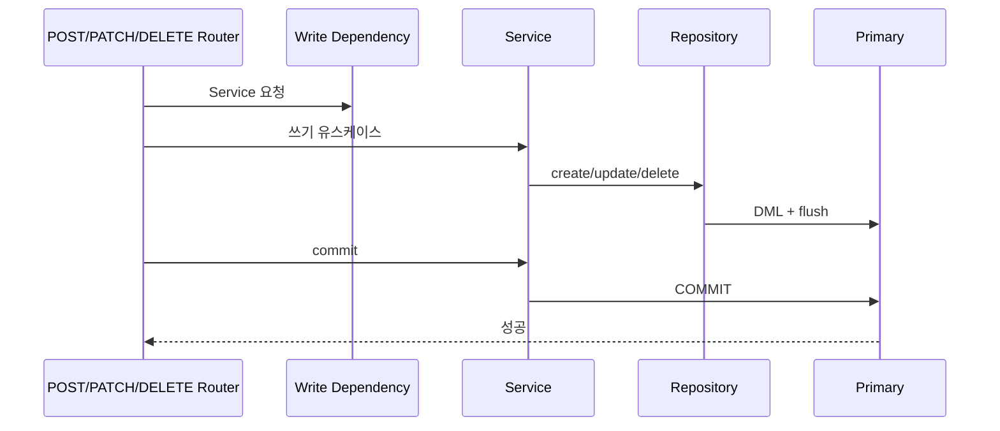

# 데이터 접근 및 트랜잭션 워크플로

| 항목 | 값 |
|---|---|
| 문서 버전 | 1.0.0 |
| 작성일 | 2026-08-18 |
| 대상 프로젝트 | fastapi-default-project-structure 0.1.0 |
| 적용 코드 기준 | Git `9c93803` |

## 1. 현재 데이터 접근 구조

현재 구현은 SQLAlchemy 비동기 ORM만 사용한다.

```text
Router → Service → Feature Repository → BaseRepository → AsyncSession → DatabaseRouter → Engine
```

`docs/orm-raw-repository/`에 기술된 Raw Repository와 ORM/Raw 이중 backend는 계획이며 현재 코드에는 없다.

## 2. 세션 종류

| API | 용도 | 라우팅/트랜잭션 특성 |
|---|---|---|
| `get_session()` | 일반 요청 | statement 기반 자동 라우팅, 예외 시 rollback |
| `get_read_session()` | 조회 endpoint | Router 활성 시 reader 고정과 쓰기 차단 |
| `get_write_session()` | 명시적 쓰기 endpoint | 첫 statement부터 writer 고정 |
| `background_session()` | middleware·Celery 등 요청 밖 | 별도 background pool, 호출자가 commit |
| `get_background_session()` | generator 방식 요청 밖 DI | 별도 background pool, 예외 시 rollback |

현재 기능 앱의 쓰기 dependency는 `get_session()`을 사용하며 조회 dependency는 `get_read_session()`을 사용한다.

## 3. 엔진과 풀

| 엔진 | 기본 풀 설정 | 용도 |
|---|---|---|
| primary/writer | pool 20 + overflow 20, timeout 30초 | API 요청 쓰기와 기본 단일 DB |
| replica/readers | replica별 pool 20 + overflow 20 | 복제 활성 시 SELECT |
| background | pool 10 + overflow 10, timeout 60초 | 접속 로그와 요청 밖 작업 |

모든 엔진은 pre-ping, recycle 280초, 반환 시 rollback reset을 사용한다. replica 수가 늘면 reader pool 총 연결 수도 함께 증가하므로 DB 연결 한도를 별도로 산정해야 한다.

## 4. 읽기/쓰기 라우팅



- Router가 꺼져 있으면 모든 요청이 primary에 직접 연결된다.
- Router와 replication이 활성화되고 replica URL이 있으면 일반 SELECT는 replica로 간다.
- 한 세션은 하나의 reader에 고정되어 트랜잭션 내 스냅샷 분산을 피한다.
- 쓰기 구문은 primary로 가며 기본적으로 이후 SELECT도 primary에 sticky된다.
- 읽기 전용 세션에서 쓰기를 시도하면 `ReadOnlyRoutingError`가 발생한다.

## 5. 조회 트랜잭션



조회 코드에서 명시적 커밋을 호출하지 않는다. 복제 지연을 허용할 수 없는 조회는 일반 세션에서 writer 고정을 명시해야 한다.

## 6. 쓰기 트랜잭션



커밋은 Router 본문에서 응답 생성 전에 실행한다. Repository나 dependency teardown이 최종 커밋을 대신하지 않는다. 처리나 커밋 중 예외가 나면 dependency가 rollback하고 오류가 전역 handler로 전달된다.

여러 Service 작업을 하나의 원자 단위로 묶으려면 같은 session을 공유하고 모든 작업이 끝난 뒤 한 번만 commit한다.

## 7. Background 트랜잭션

접속 로그 sink와 Celery task는 다음 패턴을 사용한다.

```python
async with background_session() as session:
    await SomeService(session).do_work()
    await session.commit()
```

context manager는 예외 시 rollback하고 session을 닫지만 성공 시 자동 commit하지 않는다. 호출자가 커밋을 생략하면 쓰기가 유지되지 않는다.

## 8. Repository 사용 기준

- 기능 Repository가 `BaseRepository[Model]`을 상속하고 `model`을 지정한다.
- 단순 CRUD와 공통 필터·페이지 조회는 base API를 재사용한다.
- 도메인 전용 조회는 기능 Repository에 명시적 method로 추가한다.
- Service는 Repository 결과가 없을 때 기능별 예외로 변환한다.
- 입력 dictionary는 Pydantic schema의 `model_dump(exclude_unset=True)` 등을 통해 통제한다.
- 외부 요청의 임의 컬럼명·정렬식·SQL 조각을 그대로 전달하지 않는다.

## 9. 설정 체크리스트

| 목적 | 설정 |
|---|---|
| 단일 DB | `DB_ROUTER_ENABLED=false` |
| Router만 활성 | `DB_ROUTER_ENABLED=true`, replication은 false |
| 읽기 replica | Router와 replication true, `MYSQL_REPLICA_HOSTS` 지정 |
| read-after-write | `DB_READ_STICKY_AFTER_WRITE=true` 권장 |
| Alembic 별도 URL | `ALEMBIC_DATABASE_URL` 선택 지정 |

DB DSN을 로그에 표시할 때는 `mask_dsn()` 또는 `describe_routing()`이 제공하는 마스킹된 값을 사용해야 한다.

## 10. 관련 문서

- [전체 요청 워크플로](04-request-workflow.md)
- [기능별 워크플로](07-feature-workflows.md)
- [향후 ORM/Raw 고도화 요구사항](../../orm-raw-repository/2026-08-13/requirements.md)

## 변경 이력

| 문서 버전 | 작성일 | 변경 내용 |
|---|---|---|
| 1.0.0 | 2026-08-18 | 현재 ORM, 세션, DB Router와 트랜잭션 경계 최초 정리 |
