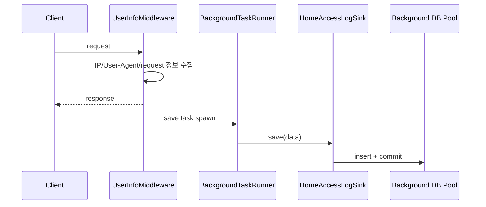

# 기능별 워크플로

| 항목 | 값 |
|---|---|
| 문서 버전 | 1.0.0 |
| 작성일 | 2026-08-18 |
| 대상 프로젝트 | fastapi-default-project-structure 0.1.0 |
| 적용 코드 기준 | Git `9c93803` |

## 1. Auth

| Method | Path | 기능 |
|---|---|---|
| POST | `/api/v1/auth/register` | 사용자 등록 후 커밋 |
| POST | `/api/v1/auth/login` | OAuth2 form 인증과 token 발급 |
| POST | `/api/v1/auth/refresh` | Refresh Token 검증과 token 재발급 |
| GET | `/api/v1/auth/me` | Access Token 기반 현재 사용자 조회 |

### 회원가입

`RegisterRequest → AuthService.register → UserRepository username 중복 확인 → bcrypt hash → User 생성 → Router commit → UserResponse`

### 로그인과 토큰

`OAuth2 form → username 조회 → 활성 상태와 bcrypt 검증 → access/refresh JWT 발급`

Refresh는 refresh 전용 secret과 token type을 검증한다. 현재 refresh token 저장·폐기 목록은 없으므로 발급 후 서버 측 강제 무효화 기능은 제공하지 않는다.

## 2. Blog

| Method | Path | 세션 | 기능 |
|---|---|---|---|
| POST | `/api/v1/blog/posts` | 쓰기 | 게시글 생성·커밋 |
| GET | `/api/v1/blog/posts` | 읽기 전용 | 페이지 목록 |
| GET | `/api/v1/blog/posts/{post_id}` | 읽기 전용 | 단건 조회 |
| PATCH | `/api/v1/blog/posts/{post_id}` | 쓰기 | 부분 수정·커밋 |
| DELETE | `/api/v1/blog/posts/{post_id}` | 쓰기 | 삭제·커밋, 204 |

생성·수정·삭제는 `BlogService → PostRepository` 흐름이다. 단건 대상이 없으면 Blog 기능 예외를 발생시킨다. 목록은 pagination query를 받아 전체 수와 항목을 응답 schema로 구성한다.

## 3. Reply

| Method | Path | 세션 | 기능 |
|---|---|---|---|
| POST | `/api/v1/reply/replies` | 쓰기 | 댓글 생성·커밋 |
| GET | `/api/v1/reply/replies` | 읽기 전용 | 페이지 목록 |
| GET | `/api/v1/reply/replies/{reply_id}` | 읽기 전용 | 단건 조회 |
| PATCH | `/api/v1/reply/replies/{reply_id}` | 쓰기 | 부분 수정·커밋 |
| DELETE | `/api/v1/reply/replies/{reply_id}` | 쓰기 | 삭제·커밋, 204 |

동작 형태는 Blog와 같고 `ReplyService`와 `ReplyRepository`를 사용한다. 현재 모델 수준에서 Blog Post와의 외래키 관계를 전제로 한 중첩 route는 제공하지 않는다.

## 4. SNS

| Method | Path | 세션 | 기능 |
|---|---|---|---|
| POST | `/api/v1/sns/posts` | 쓰기 | 피드 게시물 생성·커밋 |
| GET | `/api/v1/sns/posts` | 읽기 전용 | 페이지 목록 |
| GET | `/api/v1/sns/posts/{post_id}` | 읽기 전용 | 단건 조회 |
| PATCH | `/api/v1/sns/posts/{post_id}` | 쓰기 | 부분 수정·커밋 |
| DELETE | `/api/v1/sns/posts/{post_id}` | 쓰기 | 삭제·커밋, 204 |

`SnsService → SnsPostRepository → SnsPost`로 처리한다. 좋아요, 팔로우, 미디어 업로드, 피드 추천은 현재 범위에 없다.

## 5. User

| Method | Path | 세션 | 기능 |
|---|---|---|---|
| POST | `/api/v1/user/users` | 쓰기 | 사용자 생성·커밋 |
| GET | `/api/v1/user/users` | 읽기 전용 | 페이지 목록 |
| GET | `/api/v1/user/users/{user_id}` | 읽기 전용 | 단건 조회 |
| PATCH | `/api/v1/user/users/{user_id}` | 쓰기 | 부분 수정·커밋 |
| DELETE | `/api/v1/user/users/{user_id}` | 쓰기 | 삭제·커밋, 204 |

사용자 생성은 username 중복을 검사한다. Auth의 `/register`도 같은 User 모델과 Repository를 사용하지만 비밀번호 hashing과 인증 규칙을 AuthService에서 적용한다. SQLAdmin의 User view는 hashed password 컬럼을 화면에서 제외한다.

## 6. Home / Access Log

| Method | Path | 기능 |
|---|---|---|
| GET | `/api/v1/home/access-logs` | 페이지 목록 |
| GET | `/api/v1/home/access-logs/recent` | 최근 로그 |
| GET | `/api/v1/home/access-logs/by-ip/{ip_address}` | IP별 로그 |
| GET | `/api/v1/home/access-logs/by-user/{user_id}` | 사용자별 로그 |
| GET | `/api/v1/home/access-logs/stats` | 장치·OS·브라우저 통계 |

모든 Home API는 읽기 전용 세션을 사용한다. 쓰기는 API가 아니라 middleware 후처리에서 발생한다.

home의 `AppConfig.ready()`가 sink를 등록하지 않았다면 middleware는 저장을 건너뛴다. 즉 home 앱을 `INSTALLED_APPS`에서 제거하면 Home Router와 Model뿐 아니라 접속 로그 영속화 결선도 함께 빠진다.

## 7. 공통 CRUD 흐름

Blog, Reply, SNS, User의 공통 패턴은 다음과 같다.

| 작업 | 흐름 |
|---|---|
| Create | schema 검증 → Repository create/flush → Router commit → response |
| List | pagination 검증 → Repository count/get_many → list response, commit 없음 |
| Retrieve | id 조회 → 없으면 기능별 Not Found → response |
| Update | 대상 조회 → 변경된 필드만 update/flush → Router commit |
| Delete | 대상 삭제/flush → Router commit → 204 |

## 8. Celery 예시 기능

`home.aggregate_access_stats` task는 중앙 Celery 앱에 등록되어 `background_session()`을 열고 `UserAccessLogService.get_stats()` 결과 중 total을 반환한다. broker와 result backend는 Redis 설정을 사용한다.

## 9. 기능 확장 시 체크

1. Schema에 외부 입력 허용 범위를 명시한다.
2. Repository에 데이터 연산을, Service에 비즈니스 규칙을 둔다.
3. 조회/쓰기 dependency를 구분한다.
4. 쓰기 Router는 응답 전에 한 번만 commit한다.
5. 기능별 Router aggregate와 AppConfig 공개 이름 규칙을 지킨다.
6. `INSTALLED_APPS`에 등록한다.
7. Model 변경은 migration과 테스트를 함께 추가한다.

## 10. 관련 문서

- [전체 요청 워크플로](04-request-workflow.md)
- [데이터 접근 및 트랜잭션 워크플로](06-data-and-transaction-workflow.md)

## 변경 이력

| 문서 버전 | 작성일 | 변경 내용 |
|---|---|---|
| 1.0.0 | 2026-08-18 | Auth, Blog, Reply, SNS, User, Home 및 Celery 흐름 최초 정리 |
