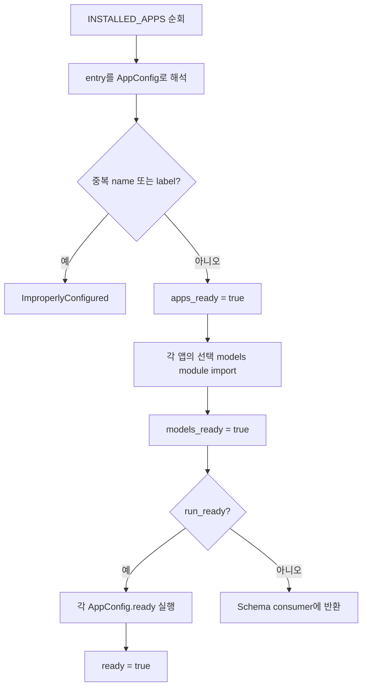
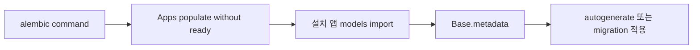

# 앱 등록 및 기동 워크플로

| 항목 | 값 |
|---|---|
| 문서 버전 | 1.1.0 |
| 작성일 | 2026-08-20 |
| 대상 프로젝트 | fastapi-project-structure-django-passive-style 0.1.0 |
| 적용 코드 기준 | Git `b88f654` |

## 1. 설치 계약

기능 앱의 활성 여부는 `config.py`의 `INSTALLED_APPS`만으로 결정한다. `app/features/`에 패키지가 있어도 목록에 없으면 Router, Model, Admin, `ready()`가 모두 비활성 상태다.

권장 등록 형식은 config class의 전체 경로다.

```python
INSTALLED_APPS = [
    "app.features.home.apps.HomeConfig",
    "app.features.blog.apps.BlogConfig",
    "app.features.catalog.apps.CatalogConfig",   # ORM 예제
    "app.features.reports.apps.ReportsConfig",   # Raw SQL 예제
]
```

**순서가 계약이다.** 목록 순서가 모델 로드·`ready()`·Router·Admin 등록 순서를 결정하므로,
새 앱은 기존 앱 **뒤에** 둔다. 중간에 끼우면 라우터 등록 순서가 바뀐다.

등록 로직은 `app/core/apps/registry.py`, 조립 진입점은 `app/core/bootstrap.py` 에 있다.

Package 경로만 등록할 수도 있지만 `<package>.apps`에서 기본 config를 선택하는 규칙이 적용되므로 명시적 class 경로가 검토에 더 유리하다.

## 2. Registry population



### 1단계: Config

- 전체 package 경로와 label을 정규화한다.
- 중복 앱 이름과 중복 label을 거부한다.
- 잘못된 identifier, 모호한 기본 config, 잘못된 class 경로를 거부한다.

### 2단계: Models

- 각 앱의 `models` module이 있으면 import한다.
- SQLAlchemy mapped class를 앱별로 수집한다.
- module이 없으면 모델 없는 앱으로 건너뛴다.
- module 내부 import 실패는 숨기지 않고 기동을 중단한다.

### 3단계: Ready

- `run_ready=true`일 때 설치 순서로 `ready()`를 한 번 실행한다.
- home 앱은 여기서 access-log sink를 core middleware에 등록한다.
- `ready()`는 process-local 결선만 수행해야 하며 DB·network·subprocess 같은 외부 부수효과를 넣지 않는 것이 현재 설계 계약이다.

## 3. FastAPI 조립

Registry가 준비되면 `create_app()`이 다음 순서로 동작한다.

1. FastAPI와 lifespan 생성
2. CORS와 사용자 정보 middleware 등록
3. 네 종류의 전역 예외 handler 등록
4. 설치 앱별 Router import와 route 충돌 검사
5. 각 Router를 AppConfig의 기본 `/api` prefix에 등록
6. `/health`와 조건부 Scalar 문서 등록
7. Admin이 활성화된 경우에만 SQLAdmin을 import하고 앱별 view 등록

같은 HTTP method와 최종 path를 둘 이상의 설치 앱이 제공하면 조용히 덮지 않고 기동 실패한다.

## 4. Startup과 Shutdown

### Startup

- `DEBUG=true`: 등록 모델을 확보하고 `Base.metadata.create_all` 실행
- `DEBUG=false`: 테이블 자동 생성을 건너뛰며 Alembic 적용을 전제로 함

### Shutdown

- in-flight 접속 로그 task를 drain
- primary 엔진 dispose
- 모든 replica 엔진 dispose
- background 엔진 dispose

## 5. Alembic 워크플로

Alembic은 런타임과 같은 `INSTALLED_APPS`를 읽되 격리된 `Apps()`와 `run_ready=false`를 사용한다.



이 때문에 미설치 앱의 모델은 autogenerate 대상에 포함되지 않는다.

## 6. 신규 앱 생성 워크플로

```powershell
uv run python -m scripts.new_app orders --with-models --with-admin
```

1. 이름이 소문자 snake_case Python identifier인지 검증한다.
2. resolve된 대상이 `app/features` 경계 안인지 확인한다.
3. 임시 디렉터리에 전체 골격을 생성한다.
4. 성공한 경우에만 최종 위치로 이동한다.
5. 기존 대상은 덮어쓰지 않는다.
6. 생성 후 개발자가 `INSTALLED_APPS`에 아래 항목을 추가한다.

```python
"app.features.orders.apps.OrdersConfig",
```

7. 모델이 있다면 Alembic revision을 생성·검토·적용한다.
8. 신규 route와 앱 등록 테스트를 실행한다.

생성기 자체는 설정 파일을 수정하지 않으므로 생성 직후 앱은 미설치 상태다.
생성기 구현은 `scripts/new_app.py` 에 있다.

> **주의 — 생성기 골격은 현재 OpenAPI 계약을 만족하지 않는다.**
>
> `scripts/new_app.py` 가 만드는 endpoint 에는 `operation_id` 가 없다. 그런데
> `tests/test_openapi_contract.py` 는 모든 operation 이 **직접 지은** `operation_id` 를
> 갖기를 요구한다. 생성 직후 그대로 검수 게이트를 돌리면 이 규칙에서 걸린다.
>
> 생성 후 각 endpoint 에 `operation_id`·`summary` 를 직접 붙이고, 새 태그를 썼다면
> `app/core/tags_metadata.py` 에도 설명을 추가한다. 참고할 실물은
> `app/features/catalog/api/routers/v1/products.py` 다.

## 7. 실패 진단

| 증상 | 우선 확인 |
|---|---|
| 기능 route가 404 | `INSTALLED_APPS`, Router 공개 변수명, prefix |
| 모델이 migration에 없음 | 앱 설치 여부, `models` package와 mapped class |
| Admin view가 없음 | `ADMIN`, 앱 설치 여부, `admin_views` |
| 기동 중 import 오류 | 선택 module 내부 의존성 또는 공개 이름 누락 |
| route 충돌 오류 | 설치 앱별 method+최종 path 중복 |
| ready hook 중 재진입 오류 | `ready()` 안의 `populate()` 호출 제거 |

## 8. 관련 문서

- [시스템 설계](02-system-design.md)
- [운영·보안·품질 워크플로](08-operations-security-quality-workflow.md)

## 변경 이력

| 문서 버전 | 작성일 | 변경 내용 |
|---|---|---|
| 1.1.0 | 2026-08-20 | 예제 앱 2종 등록 예시와 순서 계약 명시, 생성기 골격과 OpenAPI 계약의 간극 경고 추가 |
| 1.0.0 | 2026-08-18 | 앱 설치, Registry, 조립, migration과 scaffold 흐름 최초 정리 |
