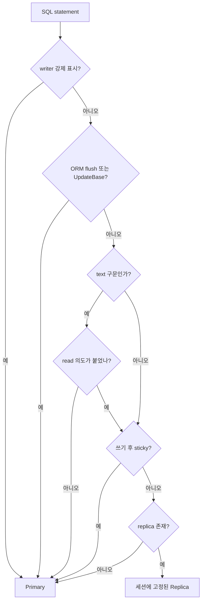
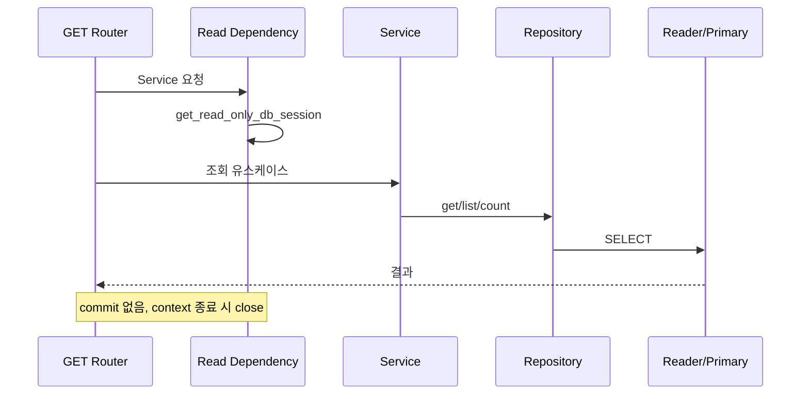
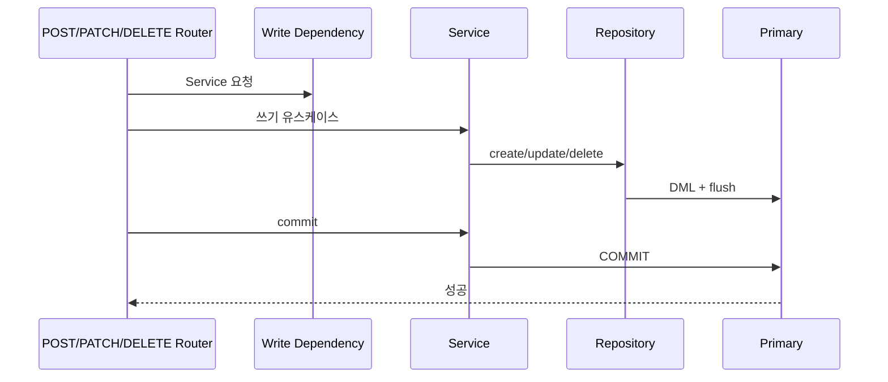

# 데이터 접근 및 트랜잭션 워크플로

| 항목 | 값 |
|---|---|
| 문서 버전 | 1.0.0 |
| 작성일 | 2026-08-18 |
| 대상 프로젝트 | fastapi-default-project-structure 0.1.0 |
| 적용 코드 기준 | Git `9c93803` |

## 1. 현재 데이터 접근 구조

데이터 접근은 **ORM 과 Raw SQL 두 갈래**를 제공한다. 갈라지는 곳은 Repository 하나뿐이고,
그 앞뒤(Router → Service, Session → Engine)는 두 갈래가 똑같다.

```text
Router → Service → ┌ Feature Repository → BaseRepository      (ORM)
                   └ Feature Repository → RawRepositoryBase   (Raw SQL)
                                    ↓
                   AsyncSession → DatabaseRouter → Engine
```

| 갈래 | Base | 정의 위치 | 예제 기능 |
|---|---|---|---|
| ORM | `BaseRepository[Model]` | `app/core/repositories/repository_base.py` | `app/features/catalog/` |
| Raw | `RawRepositoryBase` | `app/core/repositories/raw_repository_base.py` | `app/features/reports/` |

어느 쪽을 고를지는 [ORM/Raw 선택 기준](09-orm-vs-raw-decision.md)에서 다룬다.

## 2. 세션 종류

| API | 용도 | 라우팅/트랜잭션 특성 |
|---|---|---|
| `get_routed_db_session()` | 일반 요청 | statement 기반 자동 라우팅, 예외 시 rollback |
| `get_read_only_db_session()` | 조회 endpoint | Router 활성 시 reader 고정과 쓰기 차단 |
| `get_writer_db_session()` | 명시적 쓰기 endpoint | 첫 statement부터 writer 고정 |
| `background_session()` | middleware·Celery 등 요청 밖 | 별도 background pool, 호출자가 commit |
| `get_background_session()` | generator 방식 요청 밖 DI | 별도 background pool, 예외 시 rollback |

기능 앱이 실제로 쓰는 것은 **아래 두 개뿐**이다 — 조회는 `get_read_only_db_session()`,
쓰기는 `get_writer_db_session()`. 둘 다 어느 엔진으로 갈지가 **이름에 적혀 있어서**,
코드를 읽는 사람이 라우팅 결과를 추측하지 않아도 된다.

`get_routed_db_session()` 은 statement 를 보고 자동으로 판정한다. 편해 보이지만 어느
엔진으로 갈지가 실행 시점까지 정해지지 않는다. 그래서 이 저장소의 기능 앱은 쓰지 않고,
**어느 쪽인지 미리 단정할 수 없는 경우**를 위해 남겨 둔 공개 API 다.

> **Raw SQL 은 이 선택이 더 중요하다.** ORM 은 `Model` 타입만 봐도 쓰기인지 알 수 있지만
> `text("UPDATE …")` 는 그냥 문자열이라 타입으로는 알 수 없다. 그래서 Raw 쓰기는
> `get_writer_db_session()` 을 **반드시** 명시한다. §5 참고.

## 3. 엔진과 풀

| 엔진 | 기본 풀 설정 | 용도 |
|---|---|---|
| primary/writer | pool 20 + overflow 20, timeout 30초 | API 요청 쓰기와 기본 단일 DB |
| replica/readers | replica별 pool 20 + overflow 20 | 복제 활성 시 SELECT |
| background | pool 10 + overflow 10, timeout 60초 | 접속 로그와 요청 밖 작업 |

모든 엔진은 pre-ping, recycle 280초, 반환 시 rollback reset을 사용한다. replica 수가 늘면 reader pool 총 연결 수도 함께 증가하므로 DB 연결 한도를 별도로 산정해야 한다.

## 4. 읽기/쓰기 라우팅



- Router가 꺼져 있으면 모든 요청이 primary에 직접 연결된다.
- Router와 replication이 활성화되고 replica URL이 있으면 일반 SELECT는 replica로 간다.
- 한 세션은 하나의 reader에 고정되어 트랜잭션 내 스냅샷 분산을 피한다.
- 쓰기 구문은 primary로 가며 기본적으로 이후 SELECT도 primary에 sticky된다.
- 읽기 전용 세션에서 쓰기를 시도하면 `ReadOnlyRoutingError`가 발생한다.

### 4-1. `text()` 는 왜 따로 판정하나

ORM 구문은 **타입으로** 성격이 확정된다 — flush 이거나 `UpdateBase` 면 쓰기다. 그런데
`text("UPDATE …")` 는 그냥 문자열이라 타입이 알려주는 것이 없다.

첫 단어를 파싱하는 방법이 떠오르지만, 이렇게 뚫린다.

```sql
WITH doomed AS (SELECT id FROM probe) DELETE FROM probe WHERE id = 1
```

첫 단어가 `WITH` 라 읽기로 오판하고, 이 DELETE 가 replica 로 간다. replica 에서 지운
행은 복제가 덮어쓰면서 **조용히 사라진다**. 소문자·선행 공백·주석도 같은 부류의 구멍이다.

그래서 SQL 을 해석하지 않는다. **호출부가 의도를 붙인다.**

| 함수 | 하는 일 |
|---|---|
| `read_intent(stmt)` | 이 구문을 읽기로 표시 → replica 허용 |
| `write_intent(stmt)` | 이 구문을 쓰기로 표시 → primary 고정 |
| `statement_intent(stmt)` | 붙은 의도를 돌려준다 (없으면 `None`) |

의도가 **없으면 쓰기로 본다**(fail-closed). 읽기로 잘못 보면 DML 이 replica 로 새지만,
쓰기로 잘못 보면 SELECT 하나가 primary 로 갈 뿐이다. 손해의 크기가 다르므로 모를 때는
비싼 쪽이 아니라 **안전한 쪽**을 고른다.

의도를 직접 붙일 일은 거의 없다. `RawRepositoryBase` 를 통하면 메서드 이름이 곧
의도다 — `fetch_all()` 은 읽기, `execute()` 는 쓰기로 자동 표시된다. 이 함수들은
Raw Base 를 우회해야 하는 예외 상황을 위한 것이다.

정의 위치: `app/core/db/router.py`

## 5. 조회 트랜잭션



조회 코드에서 명시적 커밋을 호출하지 않는다. 복제 지연을 허용할 수 없는 조회는 일반 세션에서 writer 고정을 명시해야 한다.

## 6. 쓰기 트랜잭션



커밋은 Router 본문에서 응답 생성 전에 실행한다. Repository나 dependency teardown이 최종 커밋을 대신하지 않는다. 처리나 커밋 중 예외가 나면 dependency가 rollback하고 오류가 전역 handler로 전달된다.

여러 Service 작업을 하나의 원자 단위로 묶으려면 같은 session을 공유하고 모든 작업이 끝난 뒤 한 번만 commit한다.

## 7. Background 트랜잭션

접속 로그 sink와 Celery task는 다음 패턴을 사용한다.

```python
async with background_session() as session:
    await SomeService(session).do_work()
    await session.commit()
```

context manager는 예외 시 rollback하고 session을 닫지만 성공 시 자동 commit하지 않는다. 호출자가 커밋을 생략하면 쓰기가 유지되지 않는다.

## 8. Repository 사용 기준

### 8-1. 두 갈래 공통

- Service는 Repository 결과가 없을 때 기능별 예외로 변환한다.
- 입력 dictionary는 Pydantic schema의 `model_dump(exclude_unset=True)` 등을 통해 통제한다.
- **외부 요청의 임의 컬럼명·정렬식·SQL 조각을 그대로 전달하지 않는다.**
- Repository 는 commit 하지 않는다 — 트랜잭션 경계는 endpoint 가 소유한다.

### 8-2. ORM — `BaseRepository[Model]`

- 기능 Repository가 `BaseRepository[Model]`을 상속하고 `model`을 지정한다.
- 단순 CRUD와 공통 필터·페이지 조회는 base API를 재사용한다.
- 도메인 전용 조회는 기능 Repository에 명시적 method로 추가한다.

공개 메서드는 **8개**다. 이보다 넓히지 않는다 — 넓힐수록 "이 Repository 가 무엇을 할 수
있는가" 를 읽는 사람이 추적해야 할 표면이 커진다.

| 분류 | 메서드 |
|---|---|
| 조회 | `get_by_id` · `get_one` · `get_all` · `count` · `exists` |
| 변경 | `create` · `update` · `delete` |

예제: `app/features/catalog/repositories/product_repository.py`

### 8-3. Raw SQL — `RawRepositoryBase`

- 기능 Repository가 `RawRepositoryBase`를 상속한다. `model` 은 지정하지 않는다.
- SQL 은 **모듈 상수** `text()` 로 둔다. 메서드 안에서 문자열을 조립하지 않는다.
- 외부 값은 **전부 named bind parameter**(`:start_at`)로 넘긴다.
- 모든 호출에 `query_name` 을 준다 — `feature.use_case` 형식의 **코드 상수**다.

공개 메서드는 **4개**다.

| 메서드 | 돌려주는 것 | 라우팅 |
|---|---|---|
| `fetch_one` | `RowMapping \| None` | 읽기 (`for_update=True` 면 쓰기) |
| `fetch_all` | `Sequence[RowMapping]` | 읽기 (`for_update=True` 면 쓰기) |
| `fetch_scalar` | 첫 행 첫 컬럼 | 읽기 (`for_update=True` 면 쓰기) |
| `execute` | 영향 행 수 `int` | **항상 쓰기** |

예제: `app/features/reports/repositories/sales_report_repository.py`

#### `query_name` 이 왜 필수인가

Raw SQL 은 느린 쿼리가 나왔을 때 **어느 코드가 냈는지** 알기 어렵다. ORM 은 모델
이름이 로그에 남지만 `text()` 는 SQL 문자열만 남는다. `query_name` 은 그 자리를
메운다 — 구조화 로그에 그대로 실려서, 로그에서 이름으로 바로 코드를 찾을 수 있다.

형식은 `feature.use_case` 로 강제한다(소문자·숫자·`_`, 점 하나, 64자 이하).
규칙을 벗어나면 `InvalidQueryNameError` 가 난다.

**요청값을 넣으면 안 된다.** 사용자가 준 문자열을 `query_name` 으로 쓰면 로그가
오염되고, 이름별 집계가 무의미해진다. 반드시 코드 상수여야 한다.

```python
QUERY_DAILY_SALES = "sales_report.daily_sales"   # 모듈 상수
```

#### 잠금 읽기는 `for_update=True`

`SELECT … FOR UPDATE` 는 문법상 SELECT 지만 **replica 에서 잠근 행은 아무것도 보호하지
않는다**. `for_update=True` 를 주면 writer 로 고정된다.

읽기 전용 세션에서 잠금 읽기를 시도하면 `ReadOnlyRoutingError` 가 난다.

## 9. 설정 체크리스트

| 목적 | 설정 |
|---|---|
| 단일 DB | `DB_ROUTER_ENABLED=false` |
| Router만 활성 | `DB_ROUTER_ENABLED=true`, replication은 false |
| 읽기 replica | Router와 replication true, `MYSQL_REPLICA_HOSTS` 지정 |
| read-after-write | `DB_READ_STICKY_AFTER_WRITE=true` 권장 |
| Alembic 별도 URL | `ALEMBIC_DATABASE_URL` 선택 지정 |

DB DSN을 로그에 표시할 때는 `mask_dsn()` 또는 `describe_routing()`이 제공하는 마스킹된 값을 사용해야 한다.

## 10. 관련 문서

- [전체 요청 워크플로](04-request-workflow.md)
- [기능별 워크플로](07-feature-workflows.md)
- [향후 ORM/Raw 고도화 요구사항](../../orm-raw-repository/2026-08-13/requirements.md)

## 변경 이력

| 문서 버전 | 작성일 | 변경 내용 |
|---|---|---|
| 1.0.0 | 2026-08-18 | 현재 ORM, 세션, DB Router와 트랜잭션 경계 최초 정리 |
